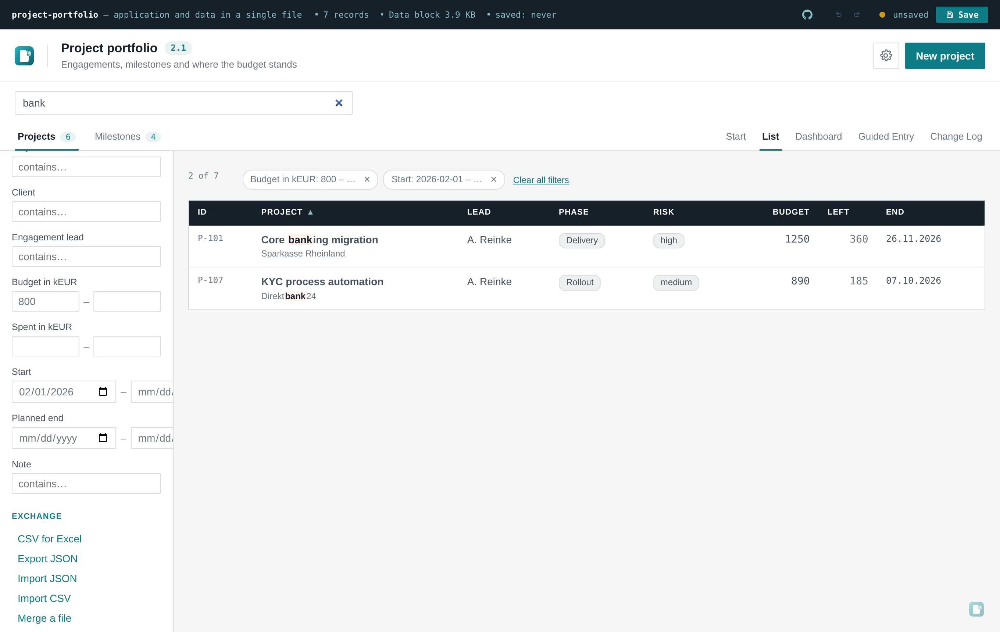
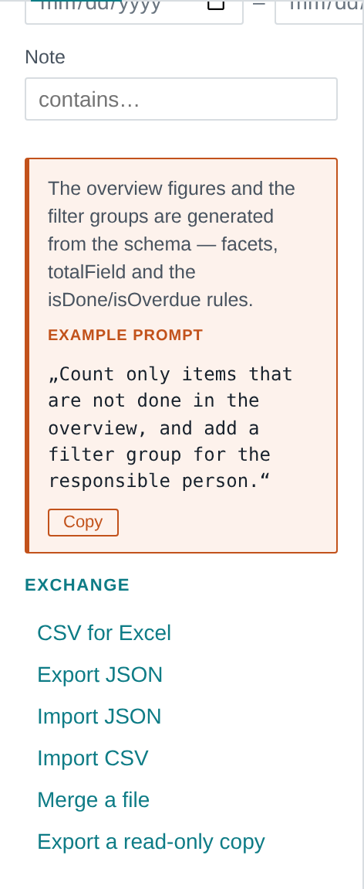
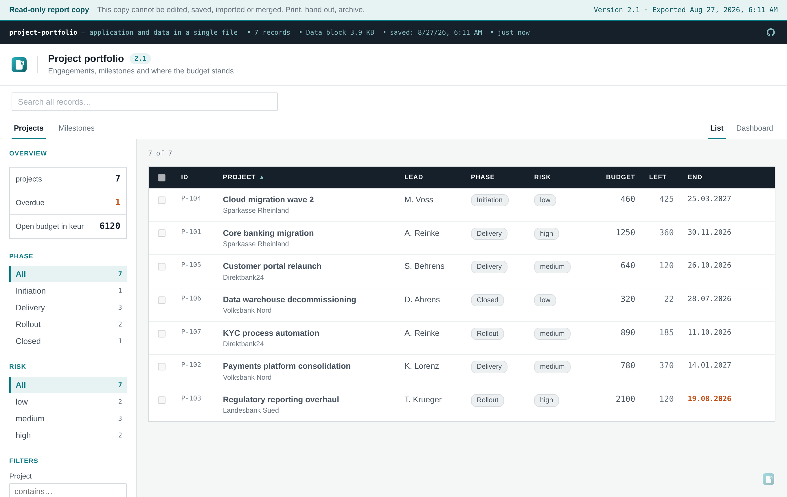
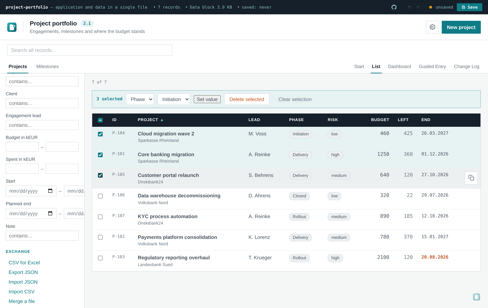

# openToolbox

[English](README.md) · **Deutsch** · [中文](README.zh.md)&nbsp;· [Español](README.es.md)&nbsp;· [Français](README.fr.md)&nbsp;· [日本語](README.ja.md)&nbsp;· [Português](README.pt.md)

**Ein funktionierendes Werkzeug als einzelne HTML-Datei ausliefern. Kein Server, keine Installation,
kein Netz.**

openToolbox ist eine Vorlage für kleine interne Werkzeuge, die unterwegs sein müssen — per Mail,
USB-Stick oder Netzlaufwerk — und auf einem zugenagelten Firmenrechner per Doppelklick laufen
sollen. Die Datei *ist* gleichzeitig die Anwendung und die Datenbank. Speichern schreibt eine neue
HTML-Datei mit den eingebetteten Daten.

Gebaut ist sie für einen Ablauf im Besonderen:

> „Bau mir ein Werkzeug zur Verfolgung von Lieferantenaudits, auf Basis von openToolbox."

Man richtet einen KI-Agenten auf dieses Repository, und er hat alles, was er braucht — das Gerüst,
und [`AGENTS.md`](AGENTS.md), das ihm sagt, was er fragen und welche Datei er ändern soll. Wie das
in der Praxis abläuft und wie man sich den ersten Schritt sparen kann, steht unten unter
[Zusammen mit einem KI-Assistenten bauen](#zusammen-mit-einem-ki-assistenten-bauen).

---

## Ansehen

[**Sechs Live-Demos**](https://m-dohmen.github.io/openToolbox/demos/) — dasselbe Gerüst als sechs
verschiedene Werkzeuge. Oder eine davon aus [`docs/demos/`](docs/demos/) herunterladen und
doppelklicken. Dieselbe Datei, in beiden Fällen ohne Server.

| Demo | Das Problem dahinter | Datenform |
| --- | --- | --- |
| [Project portfolio](https://m-dohmen.github.io/openToolbox/demos/portfolio/)<br><sub>Aufbau-Prompt: [de](https://m-dohmen.github.io/openToolbox/demos/portfolio/generating_prompt_de.md)&nbsp;· [en](https://m-dohmen.github.io/openToolbox/demos/portfolio/generating_prompt_en.md)&nbsp;· [es](https://m-dohmen.github.io/openToolbox/demos/portfolio/generating_prompt_es.md)&nbsp;· [fr](https://m-dohmen.github.io/openToolbox/demos/portfolio/generating_prompt_fr.md)&nbsp;· [pt](https://m-dohmen.github.io/openToolbox/demos/portfolio/generating_prompt_pt.md)&nbsp;· [zh](https://m-dohmen.github.io/openToolbox/demos/portfolio/generating_prompt_zh.md)&nbsp;· [ja](https://m-dohmen.github.io/openToolbox/demos/portfolio/generating_prompt_ja.md)</sub> | Projekte, Meilensteine, Budgetabweichung | 2 Datenarten, Geld |
| [Verpackungsregister](https://m-dohmen.github.io/openToolbox/demos/ppwr-packaging/)<br><sub>Aufbau-Prompt: [de](https://m-dohmen.github.io/openToolbox/demos/ppwr-packaging/generating_prompt_de.md)&nbsp;· [en](https://m-dohmen.github.io/openToolbox/demos/ppwr-packaging/generating_prompt_en.md)&nbsp;· [es](https://m-dohmen.github.io/openToolbox/demos/ppwr-packaging/generating_prompt_es.md)&nbsp;· [fr](https://m-dohmen.github.io/openToolbox/demos/ppwr-packaging/generating_prompt_fr.md)&nbsp;· [pt](https://m-dohmen.github.io/openToolbox/demos/ppwr-packaging/generating_prompt_pt.md)&nbsp;· [zh](https://m-dohmen.github.io/openToolbox/demos/ppwr-packaging/generating_prompt_zh.md)&nbsp;· [ja](https://m-dohmen.github.io/openToolbox/demos/ppwr-packaging/generating_prompt_ja.md)</sub> | PPWR: die Angaben liegen bei den Lieferanten, nicht bei einem selbst | 2 Datenarten, Anhänge |
| [Verarbeitungsverzeichnis](https://m-dohmen.github.io/openToolbox/demos/gdpr-processing/)<br><sub>Aufbau-Prompt: [de](https://m-dohmen.github.io/openToolbox/demos/gdpr-processing/generating_prompt_de.md)&nbsp;· [en](https://m-dohmen.github.io/openToolbox/demos/gdpr-processing/generating_prompt_en.md)&nbsp;· [es](https://m-dohmen.github.io/openToolbox/demos/gdpr-processing/generating_prompt_es.md)&nbsp;· [fr](https://m-dohmen.github.io/openToolbox/demos/gdpr-processing/generating_prompt_fr.md)&nbsp;· [pt](https://m-dohmen.github.io/openToolbox/demos/gdpr-processing/generating_prompt_pt.md)&nbsp;· [zh](https://m-dohmen.github.io/openToolbox/demos/gdpr-processing/generating_prompt_zh.md)&nbsp;· [ja](https://m-dohmen.github.io/openToolbox/demos/gdpr-processing/generating_prompt_ja.md)</sub> | Art. 30 DSGVO — die Antworten liegen bei zwölf Leuten | Erfassungsmodus, Aufzählungen |
| [Prüfbuch Betriebsmittel](https://m-dohmen.github.io/openToolbox/demos/equipment-testing/)<br><sub>Aufbau-Prompt: [de](https://m-dohmen.github.io/openToolbox/demos/equipment-testing/generating_prompt_de.md)&nbsp;· [en](https://m-dohmen.github.io/openToolbox/demos/equipment-testing/generating_prompt_en.md)&nbsp;· [es](https://m-dohmen.github.io/openToolbox/demos/equipment-testing/generating_prompt_es.md)&nbsp;· [fr](https://m-dohmen.github.io/openToolbox/demos/equipment-testing/generating_prompt_fr.md)&nbsp;· [pt](https://m-dohmen.github.io/openToolbox/demos/equipment-testing/generating_prompt_pt.md)&nbsp;· [zh](https://m-dohmen.github.io/openToolbox/demos/equipment-testing/generating_prompt_zh.md)&nbsp;· [ja](https://m-dohmen.github.io/openToolbox/demos/equipment-testing/generating_prompt_ja.md)</sub> | Wiederkehrende Prüfungen und das Datum, das hinterher keiner findet | Fristen und Intervalle |
| [Sanierung](https://m-dohmen.github.io/openToolbox/demos/renovation-quotes/)<br><sub>Aufbau-Prompt: [de](https://m-dohmen.github.io/openToolbox/demos/renovation-quotes/generating_prompt_de.md)&nbsp;· [en](https://m-dohmen.github.io/openToolbox/demos/renovation-quotes/generating_prompt_en.md)&nbsp;· [es](https://m-dohmen.github.io/openToolbox/demos/renovation-quotes/generating_prompt_es.md)&nbsp;· [fr](https://m-dohmen.github.io/openToolbox/demos/renovation-quotes/generating_prompt_fr.md)&nbsp;· [pt](https://m-dohmen.github.io/openToolbox/demos/renovation-quotes/generating_prompt_pt.md)&nbsp;· [zh](https://m-dohmen.github.io/openToolbox/demos/renovation-quotes/generating_prompt_zh.md)&nbsp;· [ja](https://m-dohmen.github.io/openToolbox/demos/renovation-quotes/generating_prompt_ja.md)</sub> | Drei Angebote je Gewerk, und wo das Budget wirklich steht | 2 Datenarten, Geld |
| [Klassenfahrt](https://m-dohmen.github.io/openToolbox/demos/school-trip/)<br><sub>Aufbau-Prompt: [de](https://m-dohmen.github.io/openToolbox/demos/school-trip/generating_prompt_de.md)&nbsp;· [en](https://m-dohmen.github.io/openToolbox/demos/school-trip/generating_prompt_en.md)&nbsp;· [es](https://m-dohmen.github.io/openToolbox/demos/school-trip/generating_prompt_es.md)&nbsp;· [fr](https://m-dohmen.github.io/openToolbox/demos/school-trip/generating_prompt_fr.md)&nbsp;· [pt](https://m-dohmen.github.io/openToolbox/demos/school-trip/generating_prompt_pt.md)&nbsp;· [zh](https://m-dohmen.github.io/openToolbox/demos/school-trip/generating_prompt_zh.md)&nbsp;· [ja](https://m-dohmen.github.io/openToolbox/demos/school-trip/generating_prompt_ja.md)</sub> | 28 Zettel raus, 19 zurück, und die Liste darf niemand sehen | Zustände statt Zahlen |

**Zu jeder Demo gehört ein Aufbau-Prompt.** `docs/demos/<slug>/generating_prompt_<lang>.md` ist die
vollständige fachliche Anforderung dieses Werkzeugs als Markdown — Felder, Typen, Rechenformeln,
Prüfregeln, Dashboard-Kacheln, Wizard-Schritte, Vorgaben und Startseite. Gibt man ihn zusammen mit
diesem Repository an einen KI-Agenten, kommt genau diese Anwendung zurück. Je sieben Sprachen; die
*Anweisung* ist übersetzt, die Feldbeschriftungen und Regelmeldungen nicht — sie sind das, was das
Werkzeug später tatsächlich anzeigt.

Erzeugt werden sie aus den Domänen selbst (`npm run prompts`), damit ein Prompt nicht von dem
Beispiel abweichen kann, das er beschreibt.

Die Bilder unten stammen aus dem Projektportfolio.


Zwei Datensatztypen, die aufeinander verweisen, berechnete Spalten, zählende Filter und die Version
neben dem Titel. Alles Sichtbare entsteht aus einer Datei, `src/domain.js`.


Das Dashboard berichtet über beide Datensatztypen hinweg. Gezeichnet ohne Diagrammbibliothek — die
Balken sind CSS-Breiten, der Ring ist ein einzelner SVG-Kreis. Beide Ansichten drucken als sauberes
PDF.

<table>
<tr>
<td width="50%"></td>
<td width="50%"></td>
</tr>
<tr>
<td><b>Die Datei erklärt sich selbst.</b> Hinweiskästen tragen einen fertigen Prompt, mit dem sich
genau dieser Teil ändern lässt. Ein Schalter blendet sie aus, bevor die Datei an reine Anwender geht.</td>
<td><b>Echte Daten kommen per CSV hinein</b>, mit Zuordnungsschritt. Trennzeichen und Quoting werden
erkannt; jede Zelle läuft durch dieselbe Typprüfung wie ein KI-Vorschlag.</td>
</tr>
<tr>
<td></td>
<td></td>
</tr>
<tr>
<td><b>Das Formular entsteht aus dem Schema</b>, samt Auswahlliste, die eine Referenz auf einen
anderen Datensatztyp auflöst, und schreibgeschützten berechneten Feldern.</td>
<td><b>Hell und dunkel</b>, mit der Datei gespeichert. Die Kategorieabstufungen drehen im
Dunkelmodus die Richtung, damit kein Ende der Reihe verschwindet.</td>
</tr>
<tr>
<td></td>
<td></td>
</tr>
<tr>
<td><b>Regeln entscheiden, wann gespeichert werden darf</b> — hier ein Meilenstein in Arbeit ohne
Verantwortlichen. Dieselbe Regel weist die Zeile beim CSV-Import ab und geht als Bedingung an die KI.</td>
<td><b>Die geführte Erfassung</b> führt den Empfänger durch kurze Schritte. In Schritt zwei bietet
das Referenzfeld schon den Entwurf aus Schritt eins an — ein Durchlauf legt beides an.</td>
</tr>
</table>

---

**Eine Datei · Datenbank in der Datei · optionale AES-256-Verschlüsselung · optionaler KI-Assistent ·
brandbar (Farben, Logo, Name) · zweisprachige Oberfläche (Englisch, Deutsch) · hell & dunkel ·
Dashboard · CSV-Import · Änderungsprotokoll · Versionsnummern.**

## Was drin ist

- **Eine Datei.** Rund 240 KB, in sich geschlossen. Doppelklick, sie läuft. Netzwerkkabel ziehen, sie
  läuft weiter — das Einzige, was ihr dann fehlt, ist der [Aufrufzähler](#der-aufrufzähler), und der
  ist einen sichtbaren Schalter vom Aus entfernt.
- **Die Datei ist die Datenbank.** Speichern schreibt eine neue HTML-Datei mit eingebetteten
  Datensätzen. Kein Backend, kein Browserspeicher, keine Synchronisierung.
- **Optionale Verschlüsselung.** AES-256-GCM, Schlüssel über PBKDF2 mit 310.000 Runden abgeleitet.
  Ohne die Passphrase ist die Datei ein Klumpen.
- **Optionaler KI-Assistent.** Auf einen beliebigen OpenAI-kompatiblen Endpunkt richtbar. Er liest
  die Daten, nimmt Dateianhänge als zusätzlichen Kontext und schlägt — auf ausdrückliche Anweisung —
  Änderungen vor, die vor der Anwendung freigegeben werden.
- **Brandbar.** Fünf Farben, Produktname und ein SVG-Logo, alles in der Anwendung änderbar und mit
  der Datei gespeichert. Konfiguration einmal exportieren und für jedes weitere Werkzeug wiederverwenden.
- **Hell- und Dunkelmodus**, Tastenkürzel, CSV- und JSON-Export, bis auf Telefonbreite nutzbar.
- **CSV-Import mit Spaltenzuordnung**, damit echte Daten ohne Abtippen hineinkommen — siehe
  [Daten hineinbekommen](#daten-hineinbekommen).
- **Zwei Oberflächensprachen ab Werk** (Englisch, Deutsch), eine Einstellung, die mit der Datei
  reist. Eine dritte zu ergänzen ist eine kleine, mechanische Änderung — siehe
  [Oberflächensprachen](#oberflächensprachen).
- **Mehrere Entitäten und Beziehungen**, wenn ein Datensatztyp nicht reicht — siehe
  [Mehrere Entitäten](#mehrere-entitäten-und-beziehungen).
- **Dashboard-Kacheln und ein Druck-Stylesheet**, weil Analyse meistens in einer Folie oder einer
  Anlage endet — siehe [Dashboard](#dashboard).
- **Ein Fälligkeiten-Widget im Dashboard**, mit einem Schema-Feld angeschaltet — überfällig, diese
  Woche, nächste 30 Tage, über alle Entitäten hinweg, die es deklarieren — siehe
  [Fälligkeiten](#fälligkeiten).
- **Ein Änderungsprotokoll**, bei jedem Speichern gefüllt mit Datum, Version und dem, was sich
  geändert hat — siehe [Versionen und Änderungsprotokoll](#versionen-und-änderungsprotokoll).
- **Beispiel-Prompts in der Datei**, damit der Empfänger sie ändern lassen kann, ohne diese Datei
  hier gelesen zu haben — siehe [Beispiel-Prompts](#beispiel-prompts).
- **Eine Sperre für die Einstellungsseite**, damit ein Werkzeug in der Hand eines reinen Anwenders
  nicht versehentlich umkonfiguriert wird — siehe
  [Einstellungen sperren](#einstellungen-sperren).
- **Eine änderbare Kopfzeile und bis zu fünf Verweise** in der dunklen Leiste ganz oben, auf das,
  was neben dem Werkzeug liegt — siehe [Die dunkle Leiste oben](#die-dunkle-leiste-oben).
- **Prüfregeln über Felder hinweg**, identisch durchgesetzt im Formular, beim CSV-Import, im
  Wizard und bei Vorschlägen der KI — siehe [Ein eigenes Werkzeug bauen](#ein-eigenes-werkzeug-bauen).
- **Eine bearbeitbare Startseite**, damit die Datei sich erklärt, bevor sie eine Tabelle zeigt —
  siehe [Die Startseite](#die-startseite).
- **Eine geführte Erfassung** und ein Erfassungsmodus, der die Datei direkt darin öffnet — siehe
  [Geführte Erfassung](#geführte-erfassung).
- **Rückläufer zusammenführen**, Datensatz für Datensatz und mit Feldvergleich — siehe
  [Rückläufer zusammenführen](#rückläufer-zusammenführen).
- **Anhänge mit sichtbarem Speicherbudget**, denn ein Werkzeug, das man nicht mehr verschicken kann,
  ist nicht mehr dieses Werkzeug — siehe [Anhänge](#anhänge).
- **Rückgängig/Wiederholen für die Sitzung**, für jedes Anlegen, Ändern und Löschen, Strg/Cmd+Z und
  Strg/Cmd+Y oder die zwei Knöpfe in der Dateizeile — siehe
  [Rückgängig und Wiederholen](#rückgängig-und-wiederholen).
- **Globale Suche über alle Felder aller Entitäten**, live, mit Trefferzahl am jeweiligen Reiter und
  Hervorhebung in der Tabelle, dazu Feldfilter je Feldtyp im Seitenbereich mit entfernbaren Chips
  darüber — nur für die Sitzung, nichts davon landet in der Datei — siehe
  [Suchen und Filtern](#suchen-und-filtern).
- **Sortierbare Spalten in jeder Entitätsliste** — ein Klick auf den Kopf sortiert aufsteigend,
  noch einer absteigend, ein dritter gibt die Ordnung an den Datenblock zurück; der Vergleich folgt
  dem Feldtyp, und Leerwerte stehen in beide Richtungen unten — siehe
  [Listen sortieren](#listen-sortieren).
- **Datensatz duplizieren**, aus der Tabellenzeile oder dem offenen Formular — alle Werte kommen
  mit, der Titel bekommt einen lokalisierten Zusatz, die Kopie eine eigene Kennung, und es läuft
  über denselben Weg wie ein manueller Eintrag: Undo-Stapel und Änderungsprotokoll eingeschlossen —
  siehe [Datensatz duplizieren](#datensatz-duplizieren).
- **Massenpflege mit Mehrfachauswahl** — Zeile für Zeile, als Bereich per Umschalt-Klick oder alle
  sichtbaren Zeilen auf einmal — und eine Aktionsleiste, die einen Aufzählwert setzt oder mit
  gezählter Rückfrage löscht; ein Protokolleintrag und ein Strg+Z je Aktion — siehe
  [Massenpflege](#massenpflege).

## Schnellstart

```bash
git clone https://github.com/m-dohmen/openToolbox
cd openToolbox
npm install
npm run build     # → dist/index.html
```

`dist/index.html` im Browser öffnen. Das ist alles.

## Ein eigenes Werkzeug bauen

Alles Fachliche steht in **einer Datei**: `src/domain.js`. Austauschen, neu bauen, fertig.

```js
export const SCHEMA = {
  singular: 'risk',
  plural: 'risks',
  titleField: 'name',
  list: ['name', 'owner', 'review', 'likelihood', 'impact'],
  facets: ['likelihood', 'category'],
  fields: [
    { key: 'name', label: 'Risiko', type: 'text', required: true },
    { key: 'category', label: 'Kategorie', type: 'enum', values: ['Betrieb', 'Recht', 'IT'] },
    { key: 'review', label: 'Prüfdatum', type: 'date' },
    { key: 'impact', label: 'Auswirkung', type: 'number' },
  ],
}
```

Ein Feld kann auch **berechnet** statt gespeichert sein:

```js
{ key: 'score', label: 'Risikowert', type: 'computed', compute: (r) => r.likelihood * r.impact }
```

`compute(record)` läuft einmal pro Datensatz und Anzeigevorgang, das Ergebnis wird für die
Lebensdauer der Seite auf dem Datensatz memoisert — bei tausend Datensätzen mit Sortieren, Suchen
und Export bleibt es bei einem Aufruf je Datensatz und Feld, nicht einer Welle pro Vorgang. Das
Ergebnis wird nie in den Datensatz geschrieben — eine gespeicherte Ableitung ist in dem Moment
falsch, in dem sich eine ihrer Quellen ändert, und niemand merkt es. Sortieren, Suchen, Summieren
in der Übersicht und der CSV-Export funktionieren trotzdem darauf; im Formular ist es
schreibgeschützt, und die KI wird darauf hingewiesen und beim Versuch, es zu setzen, namentlich
abgewiesen.

Wirft `compute(record)`, rendert das Feld als Strich und die Konsole sieht genau eine Warnung pro
eindeutiger Kombination aus Entität, Feldname, Datensatz-Id und Fehlertext. Die Tabelle bleibt
stehen; dieselbe Kombination meldet sich nicht zweimal.

Ein berechnetes Feld, dessen `compute` eine Zahl liefert, ersetzt im geschlossenen `sum(field)` /
`avg(field)`-Kennzahl-Katalog ein echtes Zahlenfeld — genauso wie `totalField` das schon akzeptiert.

Bedingungen **zwischen** Feldern stehen in `rules`:

```js
rules: [
  { when: (r) => r.status === 'done', require: ['owner'],
    message: 'Ein Punkt in Arbeit braucht einen Verantwortlichen.' },
]
```

Der Wert liegt im einen Aufrufort: **Formular, CSV-Import, der CSV-Schritt im Wizard und die
Vorschläge der KI laufen alle durch dieselbe Prüfung.** Eine Regel im Schema härtet alle diese Wege
gleichzeitig. Im Formular erscheint die Beanstandung unter dem Feld und das Speichern wird
verweigert; eine verstoßende CSV-Zeile wird übersprungen und benannt; das Modell bekommt die
Meldung vorab und als Begründung zurück, wenn es sie übergeht. Der JSON-Import schickt jeden
eingehenden Datensatz durch dieselbe Typ- und Regelprüfung samt Id-Kontrolle (fehlende oder
doppelte Bezeichner werden abgewiesen) und ist atomar: Ein einziger Verstoß lehnt die ganze Datei
ab, denn Protokoll und Trail keyen nach Id. `required: true` am Feld wird genauso durchgesetzt —
und eine numerische `0` zählt als gefüllt, denn null ist meistens eine echte Angabe.

Dieses Schema allein erzeugt die Tabellenspalten, das Formular, die Filter in der Seitenleiste, den
CSV-Export, die Anweisungen an das KI-Modell und die Prüfung dessen, was das Modell zurückschlägt.

### Anhänge

`type: 'attachment'` legt eine hochgeladene Datei im Datensatz selbst ab; sie reist wie alles andere
mit.

**Das Budget gehört zum Feature.** Anhänge sprengen genau das Versprechen, auf dem diese Bauform
steht — eine Datei, die man per Mail verschickt. Deshalb zeigt ein Balken in der dunklen Leiste
Belegung und Grenze und wird ab 85 % bernsteinfarben, und ein Upload, der die Grenze reißen würde,
wird beim Übernehmen abgelehnt, mit den Zahlen in der Meldung. Voreinstellung 5 MB insgesamt, 4 MB
für eine einzelne Datei, änderbar unter Einstellungen → Daten.

Anhänge erreichen die KI nie — das Modell sieht nur den Dateinamen, denn ein einziges eingebettetes
PDF wäre als base64 größer als das gesamte Kontextfenster. Der CSV-Export trägt den Namen, nicht den
Inhalt. Der abgelegte MIME-Typ wird nie zum Rendern benutzt; heruntergeladen wird immer über einen
Blob mit `download`.

## Mehrere Entitäten und Beziehungen

Die meisten Werkzeuge brauchen nur einen Datensatztyp — dafür genügt der einzelne `SCHEMA`-Export.
Sobald es wirklich zwei oder mehr Arten von Datensätzen gibt, die aufeinander verweisen (Lieferanten
und ihre Zertifikate, Projekte und ihre Meilensteine), exportiert man stattdessen `ENTITIES`: ein
Eintrag je Datensatztyp, plus ein Feld vom Typ `reference` bei dem, der auf den anderen zeigt.

```js
export const ENTITIES = {
  suppliers: { schema: { /* … */ }, uid, emptyRecord, seed, isDone, isOverdue },
  certificates: {
    schema: {
      fields: [
        { key: 'title', label: 'Titel', type: 'text', required: true },
        { key: 'supplierId', label: 'Lieferant', type: 'reference', entity: 'suppliers', required: true },
      ],
    },
    uid, emptyRecord, seed, isDone, isOverdue,
  },
}
```

Ein Reference-Feld erscheint im Formular als Auswahlliste der Zieldatensätze und in der Tabelle als
klickbare Marke mit dem Titel des Ziels — ein Klick wechselt zu jener Entität und öffnet den
Datensatz. Das Löschen eines noch referenzierten Datensatzes wird blockiert, und die Meldung nennt,
was darauf verweist. Der KI-Assistent kennt die Beziehung ebenfalls und darf ein Ziel per Id oder
per Titeltext benennen.

`examples/suppliers-certificates.domain.js` ist ein knappes Beispiel,
`examples/portfolio.domain.js` — die Grundlage der
[Live-Demo](https://m-dohmen.github.io/openToolbox/demo/) — nutzt alles auf einmal.

## Rückläufer zusammenführen

Die strukturelle Schwäche der Datei-als-Datenbank: einmal an fünf Abteilungen verschickt, kommen
fünf Dateien zurück. Bis hierher hieß das abtippen.

**Datei abgleichen** (Seitenleiste, oder Einstellungen → Daten) liest eine zweite Kopie desselben
Werkzeugs und vergleicht sie Datensatz für Datensatz. Drei Gruppen mit Auswahlkästchen: Datensätze
nur in der anderen Datei, Datensätze mit abweichenden Werten — Feld für Feld, vorher und nachher —
und Datensätze, die dort fehlen.


Zu konfigurieren gibt es nichts; gearbeitet wird mit dem Schema und den Identifikatoren. Es ist
damit für zwei Kopien **desselben** Werkzeugs gedacht, nicht für zwei beliebige Dateien. Einen
unbekannten Datensatztyp benennt der Dialog und übergeht ihn, und ein verschlüsseltes Gegenstück
fragt nach seiner eigenen Passphrase.

Eine Vorgabe ist bewusst gesetzt: **Löschungen sind nicht vorausgewählt.** Ein Datensatz, der in der
anderen Kopie fehlt, sieht genauso aus, ob er dort gelöscht wurde oder die Kopie schlicht älter ist
— und nur eine der beiden Lesarten vernichtet Daten. Alles andere ist angehakt, denn die Änderungen
zu übernehmen ist der Grund, aus dem man den Dialog öffnet.

Der Abgleich ändert den Arbeitsstand; gespeichert werden muss die Datei danach noch.

## Suchen und Filtern

Das Suchfeld steht über den Entitäts-Reitern und liest **jedes Feld jedes Datensatzes** — keine
konfigurierte Auswahl. Ein Begriff eingeben, und die Tabelle engt sich live ein, während jeder
Entitäts-Reiter zeigt, wie viele seiner Datensätze treffen; in der Tabelle selbst sind die Treffer
hervorgehoben. Gesucht wird case-insensitive, und gefunden wird, was man sieht, nicht was
gespeichert ist: Anhänge zählen nur mit ihrem Dateinamen (das eingebettete base64 ist Rauschen,
kein Text), Reference-Felder mit dem Titel des Datensatzes, auf den sie zeigen, berechnete Felder
wie alle anderen — und die Kennung zählt mit.



Ein Bild mit dem ganzen Mechanismus auf einmal: Ein Begriff, dessen Treffer in zwei Entitäten
liegen, zwei Feldfilter, die die Liste auf zwei Zeilen verengen — und über der Tabelle die Chips,
die jeden Filter tragen, daneben ein *Alles löschen*.

Unter den Facettengruppen bekommt die Seitenleiste einen Filter je Feld, das sich filtern lässt,
geformt nach seinem Typ: Text sucht auf *enthält*, eine Aufzählung bietet Mehrfachauswahl, Zahlen
und Daten nehmen einen von/bis-Bereich. Felder, die schon als Facette laufen, bleiben
Schnellfilter mit ihren Stückzahlen — sie machen weiter das, was sie gut können, und der
Filterbereich ergänzt, was sie nicht können: Bereiche, enthält-Suche, Mehrfachauswahl für
Aufzählungen ohne eigene Facettengruppe. Eine Entität ohne filterbare Feldtypen bekommt weder
Filterbereich noch Chips — nichts erscheint, was nichts täte.

Aktive Filter sammeln sich als entfernbare Chips über der Tabelle, daneben ein *Alles löschen*,
sobald es mehr als einen gibt. Mehrere Filter wirken zusammen (UND); innerhalb eines Filters sind
die gewählten Werte Alternativen (ODER) — zwei angehakte Aufzählungswerte meinen *dieser oder
jener*. Suche und Feldfilter sind bewusst unabhängig: Die Suche sagt, **wo** etwas über alle
Entitäten hinweg steht, die Filter schneiden die gerade angesehene Liste weiter — deshalb
ignorieren die Reiterzahlen die Filter.

Keines davon überlebt die Sitzung. Datei neu laden, und Suche, Filter und Facettenwahl sind weg.
Das ist gewollt: Browserspeicher ist unter `file://` unzuverlässig, der eingebettete Datenblock
ist der einzige Speicher, und nichts von „welche Teilmenge habe ich angesehen" gehört in Daten,
die jemand anderes öffnet. Eine gespeicherte Datei trägt nie einen Filter in sich — die Kopie,
die man weiterschickt, zeigt alles, genau wie ihre Druckansicht.

## Listen sortieren

Jeder Spaltenkopf einer Entitätsliste ist anklickbar. Der erste Klick sortiert aufsteigend, der
zweite absteigend, der dritte gibt die Ordnung an den Datenblock zurück — kein vierter Zustand,
und eine Spalte merkt sich ihre Richtung nicht über den Gebrauch hinaus. Der Wechsel auf eine
andere Spalte beginnt ebenfalls von vorn, aufsteigend. Solange eine Spalte sortiert, trägt ihr
Kopf einen Pfeil; für Screenreader meldet er die Richtung als `ascending`/`descending`. Eines
weiß man vorher: Beim Öffnen der Datei steht jede Liste bereits aufsteigend nach ihrer ersten
Spalte sortiert — das ist die Voreinstellung des Hauses, nicht die Datenblock-Reihenfolge. Der
dritte Klick landet deshalb auf der rohen Datenblock-Reihenfolge, die anders aussehen kann als
der Stand beim Öffnen.

Der Vergleich folgt dem Feldtyp, nicht den Zeichen auf dem Schirm: Zahlen vergleichen numerisch
(10 steht hinter 9), Daten chronologisch — ihre ISO-Schreibweise vergleicht als Zeichenkette,
und genau das ist bei Daten die chronologische Ordnung —, Text und Aufzählungen als lokalisierter
Textvergleich in der aktuellen Oberflächensprache, wobei der Wert einer Aufzählung zugleich ihre
Beschriftung ist. Eine Reference-Spalte ordnet nach dem Titel des Datensatzes, auf den sie zeigt,
nicht nach der Kennung dahinter (sortiert wird das, was man sieht), ein Anhang nach seinem
Dateinamen, ein berechnetes Feld nach dem Wert, den es liefert — numerisch, wenn dieser Wert eine
Zahl ist.

Datensätze ohne Wert in der sortierten Spalte stehen unten — in beiden Richtungen. Ein fehlender
Wert ist keine kleine Zahl und kein frühes Datum; dem Vergleich überlassen, würde er absteigend
nach oben rutschen, wo niemand „nichts" sucht. Gleichstand behält die Datenblock-Reihenfolge,
damit Gleiche nicht zwischen zwei Plätzen flackern.

Suche und Feldfilter schneiden zuerst, die Sortierung ordnet, was übrig bleibt — sortieren kann
nie zurückholen, was die Filter entfernt haben. Und wie alles, was nur die Ansicht betrifft, lebt
der Sortierzustand nur in der Sitzung: Datei neu laden, und die Datenblock-Reihenfolge ist wieder
da; in die Datei geschrieben wird nie eine Sortierung. Die Kopie, die man weitergibt, öffnet so,
wie die Daten stehen.

## Datensatz duplizieren

Beratungsdaten wiederholen sich: dieselbe Maßnahme an drei Standorten, ein Risiko je Baustein, ein
Kontakt je Rolle. Jeden **gespeicherten** Datensatz gibt es deshalb zum Duplizieren statt zum
Neutippen. Die Aktion liegt an zwei Stellen: ein Kopier-Symbol am Ende jeder Tabellenzeile (es
erscheint, wenn man mit der Maus über die Zeile fährt oder sie per Tab ansteuert — eine
Dauerleiste aus Symbolen würde die Tabelle lauter machen, als eine einzelne Aktion es verdient)
und ein Knopf im Fuß des geöffneten Formulars neben dem Löschen. Ein nie übernommener Entwurf hat
beides nicht: Es gibt keinen gespeicherten Inhalt, den eine Kopie tragen könnte.

Die Kopie übernimmt jeden Feldwert aus dem gespeicherten Stand, nicht aus einem halb ausgefüllten
Formular, das zufällig offen steht — nicht übernommene Eingaben gehören zur nächsten Sicherung des
Originals, nicht in eine Kopie; Reference-Felder zeigen weiter auf dieselben Ziele. Zwei Dinge
unterscheiden die Kopie vom Original: Das Titelfeld bekommt einen lokalisierten Zusatz („(Kopie)"
auf Deutsch, „(Copy)" auf Englisch, je nach Oberflächensprache), und die Kopie erhält eine eigene
Kennung mit dem Präfix ihrer Entität. Am Original ändert sich nichts.

Angelegt wird die Kopie über denselben Änderungsweg wie ein manuell übernommener Datensatz — und
dieser eine Satz trägt das meiste Verhalten, das man kennen sollte:

- Sie liegt auf dem [Undo-Stapel](#rückgängig-und-wiederholen) — ein `Strg`/`Cmd`+`Z` nimmt die
  ganze Kopie zurück.
- Der amberfarbene Punkt erscheint; in eine neue HTML-Datei landet die Kopie erst mit der nächsten
  Sicherung, und eine ungespeicherte Kopie überlebt kein Neuladen — wie jeder andere neue
  Datensatz auch.
- Das [Änderungsprotokoll](#versionen-und-änderungsprotokoll) leitet beim Speichern sein eigenes
  Anlegen-Ereignis für die Kopie ab, gegen den letzten gespeicherten Stand — nichts davon wird
  abgefragt oder eingetippt.

Direkt nach dem Duplizieren steht das Formular der Kopie offen — die kleinen Änderungen, derentwegen
man dupliziert, sind also der aller nächste Schritt. Eine Grenze gehört genannt: Eine Kopie mit
Anhängen verdoppelt deren Anteil am [Anhangsbudget](#anhänge), und die Prüfung, die einen zu
großen Upload ablehnt, schlägt hier sofort zu — nicht erst bei der nächsten Sicherung.

## Daten hineinbekommen

Drei Wege, alle in der Seitenleiste und unter Einstellungen → Daten:

**CSV-Import mit Zuordnungsschritt.** Datei wählen, und der Dialog listet jede gefundene Spalte
neben einer Auswahlliste der Felder. Spalten, deren Überschrift zu einer Feldbeschriftung oder einem
Feldschlüssel passt, sind vorbelegt — Groß- und Kleinschreibung sowie Satzzeichen werden dabei
ignoriert. Alles andere ordnet man von Hand zu, nicht Zugeordnetes bleibt außen vor. Anhängen oder
alles ersetzen.

Trennzeichen (`;`, Komma, Tabulator), Quoting und ein führendes BOM werden aus der Datei erkannt, ein
Excel-Export funktioniert also ohne Vorbereitung. Jede Zelle läuft durch dieselbe Typprüfung wie ein
KI-Vorschlag. **Nichts scheitert stillschweigend** — die Ergebnisanzeige benennt jede Beanstandung
mit Zeilennummer, ein schlechter Wert in einer Zelle lässt den Rest der Zeile unberührt, und eine
Zeile ohne Titel wird übersprungen statt halbleer importiert.

Kennungen vergibt immer die Anwendung, nie die Datei — dieselbe Regel wie bei Datensätzen, die die
KI anlegt.

**JSON-Import.** Ein flaches Array ersetzt die Datensätze der aktiven Entität, ein Objekt mit einem
Eintrag je Entitätsschlüssel gleich mehrere auf einmal. Es ist dasselbe Format, das *Export JSON*
schreibt — eine exportierte Datei läuft so wieder zurück in das Werkzeug. Jeder eingehende Datensatz
durchläuft dieselbe Typ- und Regelprüfung wie eine CSV-Zeile, dazu eine Id-Kontrolle: Ohne Id oder
mit doppelter Id wird der Datensatz abgelehnt. Der Import ist **atomar** — ein einziger Verstoss
lehnt die ganze Datei ab. Das ist Absicht: Die abgeleiteten Feldänderungen und das
Änderungsprotokoll ordnen ihre Einträge per Id einem Datensatz zu, und ein halb übernommener Bestand
wäre dort nicht mehr aufzulösen.

**Der KI-Assistent** kann auf ausdrückliche Anweisung Datensätze aus einer beigelegten Datei
vorschlagen. Textartige Anhänge (CSV, JSON, Markdown und ähnliche) liest er als zusätzlichen
Kontext; übernommen wird ein Vorschlag erst nach Freigabe.

## Berichtskopie exportieren

Eine Arbeitsdatei gibt dem Empfänger die Schlüssel in die Hand — derselbe Speichern-Knopf,
derselbe Wizard, dasselbe Formular. **Berichtskopie exportieren** in der Exchange-Gruppe der
Seitenleiste schreibt eine zweite HTML-Datei, in der jede Schreibfläche entfernt ist. Was beim
Lenkungskreis oder beim Kunden landet, ist nicht die Arbeitsdatei in harmloser Aufmachung.





Was sich zwischen Quelle und Kopie ändert:

- **Der Dateiname** ist `<dateiStamm>-report-<JJJJ-MM-TT>.html`. Eine kurze Suche nach `report-`
  im Ordner trifft nur Kopien — sie werden nicht mit der Arbeitsdatei verwechselt.
- **Die Kopie trägt `settings.readOnly: true`.** Jede Stelle der Oberfläche, die schreiben würde —
  Speichern, Rückgängig, Wiederholen, die Einstellungsseite, der Wizard, Import, Abgleich, der
  „Neu …“-Knopf, die Mehrfachauswahl, der Datensatz-Drawer — wird versteckt oder gesperrt.
  Referenz-Chips lassen sich weiter auflösen, aber nur durch Wechsel auf die referenzierte
  Entität; dort einen Datensatz zu öffnen wäre eine Schreibfläche.
- **Ein Banner über der Dateileiste** zeigt die Export-Beschriftung, die aus `settings.version`
  übernommene Version und den Exportzeitpunkt. Das Banner ist das Signal: Wer es sieht, weiß, dass
  die Datei nicht gespeichert werden kann — bevor er es versucht.
- **Das Änderungsprotokoll der Quelle bekommt einen Eintrag** beim Klick — „Berichtskopie
  exportiert“ — der beim nächsten Speichern der Quelle auf die Datei wandert. Ohne ihn kann
  später niemand sagen, welcher Bericht aus welcher Revision stammt.

Derselbe Single-File-Build liefert beide Seiten. Der Export ist ein einfaches
`buildDocument(reportPayload)` über einen Datenblock, in dem die Schreibflags auf einen
sicheren Standard gesetzt sind — kein zweites Bundle, kein zweiter Vite-Einstiegspunkt. Die
bau­seitigen Details stehen in [`AGENTS.md`](AGENTS.md).

## Die Startseite

Ein Werkzeug, das direkt auf einer Tabelle landet, setzt voraus, dass der Empfänger weiß, was er da
vor sich hat. Meistens weiß er es nicht — er will einen Satz dazu, wofür das gut ist, wer es pflegt
und wo man fragt. Die Anwendung öffnet auf dieser Seite, sobald Text darin steht.


Bearbeitet wird in der Anwendung selbst, in einem kleinen Markdown-Teilsatz: Überschriften, Listen,
Zitate, Trennlinie, `**fett**`, `*kursiv*`, `` `code` `` und `[Verweise](url)`. Alles andere bleibt
einfacher Text — der Inhalt wird zu einer Baumstruktur geparst und als Knoten gerendert, nie als
HTML eingesetzt. Nichts, was dort steht, kann in einer herumgereichten Datei zu Markup werden.

Zwei Dinge dazu. **Der Schutz der Einstellungen deckt diese Seite mit ab** — sind sie geschützt,
wird aus dem Bearbeiten-Knopf ein entsprechender Hinweis, denn sonst wäre der Schutz eine halbe
Sache. Und **der Text liegt bei den Einstellungen**, also außerhalb des verschlüsselten Umschlags
und lesbar, bevor jemand die Datei entsperrt: richtig für „was ist das", falsch für alles
Vertrauliche.

Leerer Text heißt, dass es die Startseite nicht gibt.

## Gespeicherte Ansichten

Suche, Facetten, Feldfilter und Sortierung leben normalerweise nur in der Sitzung. Ein Werkzeug,
das jeden Montag auf die gleiche Weise geöffnet wird — „meine offenen Punkte", „überfällig",
„Q3" — zwingt den Empfänger, die Kombination jedes Mal von Hand neu aufzubauen. Ein `views`-Array
im Schema benennt die Kombinationen, die das Dropdown am Listenkopf anbietet:

```js
export const SCHEMA = {
  // …
  views: [
    {
      name: 'Meine offenen Punkte',
      query: '',
      filters: { owner: { v: '', op: 'contains' } },
      sort: { key: 'due', dir: 1 },
    },
    { name: 'Überfällig', query: '', filters: {}, sort: { key: 'due', dir: 1 } },
  ],
}
```

Jeder Eintrag hat genau die Gestalt der laufenden Liste: `query` ist die globale Suche, `filters`
der Filterbereich in der Seitenleiste (`{ fieldKey: { v, op } }`), `sort` heißt `{ key, dir }`
(`dir` ist `1` aufsteigend, `-1` absteigend), `entity` ist optional und zeigt bei mehreren
Entitäten auf die richtige. Das Dropdown spiegelt die Werte in Suche, Facetten, Filter und
Sortierung; die Sicht selbst ist nur eine Schablone und schreibt nichts in den Datenbestand.

Die eigenen Sichten der Empfänger liegen aus zwei Gründen im Datenblock, nicht im Schema: das
Schema ist nach der Auslieferung schreibgeschützt, und dieselbe Sicht in zwei Dateien muss nach
Namen zusammenführbar sein. Gespeicherte Sichten stehen unter `settings.views`; das
`views`-Array des Schemas ist der Katalog, `settings.views` ist, was die Empfänger tatsächlich
verwenden. Beide werden gemischt: gleicher Name = die gespeicherte Sicht gewinnt.

Ein einzelner `settings.startView` (Name einer Sicht) markiert diejenige, die beim Öffnen der
Datei automatisch angewendet wird. Leer heißt: keine automatische Sicht. In den Einstellungen
steht neben dem Anwendung-Block ein kleiner Editor: Liste der aktuellen Sichten mit Umbenennen,
Löschen und „Mit dieser Ansicht öffnen"; darunter ein Eingabefeld, das die laufende Suche/Filter/
Sortierung unter einem Namen ablegt (der Knopf leuchtet erst, wenn es etwas zu speichern gibt).

Der Merge lebt in `src/lib/merge.js` und ist für den Aufrufer ein einzeiliger Zusatz: `applyMerge`
nimmt optional `{ views: { mine, theirs } }`, läuft `mergeViews` und liefert das Ergebnis als
`nextViews` neben den Daten. Zwei Dateien mit disjunkten Sichten mischen sich konfliktfrei; zwei
Dateien mit derselben Sicht behalten die letzte Änderung der Gegenseite.

## Geführte Erfassung

Liste und Formular setzen voraus, dass man das Werkzeug kennt. Wer die Datei bekommt, um *eine*
Sache zu melden, soll nicht erst eine Tabelle, eine Seitenleiste und siebzehn Felder sortieren
müssen. Ein `WIZARD`-Export gibt ihm stattdessen kurze Schritte — ohne ihn gibt es die Ansicht
schlicht nicht.

```js
export const WIZARD = {
  title: 'Feststellung melden',
  steps: [
    { id: 'was', label: 'Was', fields: ['title', 'area', 'note'] },
    { id: 'wer', label: 'Wer und wann', fields: ['owner', 'due', 'status'] },
    { id: 'bulk', label: 'Mehrere auf einmal', type: 'csv',
      when: (drafts) => Boolean(drafts.records.title) },
    { id: 'pruefen', label: 'Prüfen', type: 'review' },
  ],
  done: { message: 'Danke — das ist erfasst.', allowAnother: true },
}
```

Vier Schritttypen, mehr braucht es generisch nicht: `fields` zeigt eine Teilmenge der Schemafelder,
mit derselben Maschine und denselben Regeln wie das Formular; `csv` ist der vorhandene Import als
Schritt; `review` ist eine aus dem Schema erzeugte Zusammenfassung; der Abschluss kommt aus `done`.
Ein `when` blendet einen Schritt aus, der nicht passt.

Zwei Dinge machen daraus mehr als ein Formular:

- **Der CSV-Schritt zahlt in denselben Durchlauf ein.** Die Zeilen werden vorgemerkt und erst am
  Ende zusammen mit dem Entwurf angelegt — wer mittendrin abbricht, hinterlässt nichts.
- **Die Entwürfe bekommen ihre Id zu Beginn**, deshalb kann ein Referenzfeld in Schritt zwei bei
  mehreren Datensatztypen schon auf den Datensatz aus Schritt eins zeigen — ein Durchlauf legt den
  Lieferanten und sein Zertifikat an.

### Erfassungsmodus

Einstellungen → Anwendung → *Öffnet als* → **Geführte Erfassung** öffnet die Datei direkt im Wizard
und blendet Liste, Entitätsreiter und den „Neu"-Knopf aus. Dieselbe Datei wird damit zum
Erfassungsbogen: Empfänger füllt aus, speichert, schickt zurück. `mode: 'intake'` in
`DEFAULT_SETTINGS` liefert sie gleich so aus.

## Kanban-Ansicht

Eine `view.board`-Deklaration im Schema schaltet den Reiter neben „Liste" und „Dashboard" frei.
Ohne sie gibt es die Ansicht nicht — dieselbe Haltung wie `DASHBOARD` und `WIZARD`. Karten wandern
per Maus, Touch oder Tastatur zwischen den Spalten; jede Bewegung läuft durch denselben Pfad wie
eine Formular-Änderung und landet deshalb im Änderungsprotokoll und im Undo/Redo-Stapel.

```js
export const SCHEMA = {
  // …
  view: {
    board: {
      columnField: 'status',                   // enum-Feld, das die Spalten bildet
      cardFields: ['owner', 'due', 'effort'],  // optional: bis zu drei Felder je Karte
      limit: 50,                                // optional: Obergrenze je Spalte (Standard 50)
    },
  },
}
```

`columnField` muss auf ein enum-Feld zeigen; die Spaltenreihenfolge folgt der `values`-Liste im
Schema. Datensätze mit leerem oder ungültigem Wert landen in einer kleinen Reserve rechts —
eine Karte, die zu keiner Spalte gehört, wäre sonst unsichtbar. Berichtskopien (`settings.readOnly:
true`) zeigen das Brett weiterhin, schalten Drag&Drop aber ab.

## Dashboard

Optional, in `src/domain.js` als `DASHBOARD`-Export deklariert. Ohne ihn gibt es die Ansicht nicht.

```js
export const DASHBOARD = {
  tiles: [
    { type: 'stat',  measure: 'count', label: 'Projekte' },
    { type: 'stat',  measure: 'budget', filter: (r) => !isDone(r), label: 'Offenes Budget' },
    { type: 'donut', groupBy: 'phase' },
    { type: 'bar',   groupBy: 'phase', measure: 'budget', label: 'Budget je Phase' },
  ],
}
```

Drei Kacheltypen — `stat` (eine Zahl), `bar` (ein Balken je Aufzählungswert) und `donut` (dieselben
Daten als Ring mit Legende). `measure` ist entweder `'count'` oder ein Feldschlüssel, dessen Werte
summiert werden; `filter(record)` schränkt vorher ein; bei mehreren Entitäten benennt eine Kachel
über `entity`, worauf sie sich bezieht.

Gezeichnet **ohne Diagrammbibliothek**: Die Balken sind CSS-Breiten, der Ring ist ein einzelner
SVG-Kreis mit `stroke-dasharray`. Eine Diagrammbibliothek würde eine Datei, die per Mail durchkommen
muss, um ein Vielfaches aufblähen — für drei Kacheltypen. Die Kategoriefarben leiten sich aus der
Akzentfarbe des Werkzeugs ab, ein umgebrandetes Werkzeug färbt sein Dashboard also selbst um.

### Fälligkeiten

`dueDate` im Schema auf einen Feldschlüssel gesetzt — ein reines `date`-Feld oder ein `computed`-Feld,
genau wie `totalField` ein Zahlenfeld benennt — und oben im Dashboard erscheint ein
Fälligkeiten-Widget:

```js
export const SCHEMA = {
  // …
  dueDate: 'review',
}
```

Anders als die Kacheln oben braucht das keinen `DASHBOARD`-Export: Fälligkeitssteuerung ist der
häufigste Grund, ein solches Werkzeug überhaupt zu öffnen, deshalb erscheint das Widget von selbst,
sobald irgendeine Entität `dueDate` deklariert — mit oder ohne Kacheln. Drei Gruppen, leere werden
verborgen: **Überfällig** (vor heute), **diese Woche** (Montag bis Sonntag der laufenden lokalen
Kalenderwoche) und die **nächsten 30 Tage** danach. Ein per `isDone()` erledigter Datensatz taucht in
keiner Gruppe auf — erledigte Arbeit ist nicht mehr fällig. Verglichen wird auf lokalen
Kalendertagen, nicht auf dem UTC-Zeitpunkt, den `new Date('2026-08-20')` liefern würde — der landet
westlich von Greenwich einen Tag zu früh. Bei mehreren Entitäten aggregiert das Widget über alle, die
`dueDate` deklarieren, und ein Klick auf einen Eintrag springt direkt zum Datensatz. Eine Domäne ohne
`dueDate` sieht ihr bisheriges Dashboard unverändert.

## Kennzahl-Kacheln

Die Zahlen, die eine Steuerungsgruppe zuerst fragt — wie viele Datensätze offen sind, was sie
zusammengenommen wiegen, wie der Durchschnittsscore liegt — muss niemand mehr von Hand auszählen.
Eine Domäne deklariert sie direkt: `metrics` im Schema, je Eintrag eine Kachel, gerendert oben im
Dashboard über allem anderen. Wie `dueDate` schaltet eine `metrics`-Liste die Dashboard-Ansicht
auch allein frei — ein `DASHBOARD`-Export ist nicht nötig:

```js
export const SCHEMA = {
  // …
  metrics: [
    { op: 'count', filter: (r) => !isDone(r), label: 'Offene Risiken' },
    { op: 'sum',   field: 'impact', label: 'Gesamtimpact', caption: 'über alle Risiken' },
    { op: 'avg',   field: 'impact' },   // Vorgabe-Label: „Ø Impact score“
  ],
}
```

Der Katalog ist geschlossen — genau drei Operationen:

- `count` — die Anzahl der Datensätze, optional eingegrenzt per `filter(record)` mit derselben
  Semantik wie bei den stat-Kacheln oben. Ohne Label trägt sie den Plural der Entität.
- `sum(feld)` — die Summe über ein Zahlenfeld.
- `avg(feld)` — der Mittelwert über ein Zahlenfeld, fest auf zwei Nachkommastellen, damit aus 7
  nicht beim nächsten Datensatz 7,333 wird; der Mittelwert einer leeren Menge erscheint als Strich
  statt als erdachte Null.

Die Werte werden rein lokal beim Rendern gerechnet, über den **vollen** Bestand der Entität — nichts
davon landet in den Datensätzen oder im Datenblock, und eine Domäne ohne `metrics` sieht ihr
bisheriges Dashboard exakt unverändert.

Ein Klick auf eine Kachel springt zur Liste dieser Entität, Tastatur inklusive. In dieser Version
**ungefiltert** — die Vorfilterung bleibt bewusst zurückgestellt, bis Suche und Filter sie tragen
können, damit eine Kachel nie eine engere Zahl behauptet als die, die sie tatsächlich rechnet.

Bewusst **keine Formeln**: keinen freien Ausdruck, nichts, was ausgewertet wird. Eine Deklaration
nennt eine Operation aus dem Katalog, oder sie wird beim Laden zurückgewiesen — eine unbekannte
Operation, ein fehlendes Feld oder ein nicht-numerisches Ziel für `sum`/`avg` erscheint als benannte
Verwerfungs-Kachel zwischen den gültigen, statt still übergangen zu werden: Eine Kennzahl, die sich
stillschweigend abschaltet, fällt erst auf, wenn jemand die Zahl vermisst. Der Katalog ist aus
demselben Grund geschlossen, aus dem die Datei weitergereicht werden darf — eine Deklaration, die
Code tragen könnte, würde jeden Empfänger der Datei zum Ausführer machen.

## Versionen und Änderungsprotokoll

Zwei kleine Funktionen, die zählen, sobald eine Datei zu kursieren beginnt.

**Eine Version** ist freier Text unter Einstellungen → Anwendung — `1.4`, `2026-Q3`, `final für
Lenkungsausschuss`. Sie erscheint als Marke neben dem Titel und wandert in den Dateinamen beim
Speichern (`projektportfolio-2.1-2026-08-15.html`), damit man in einem Mailverlauf die richtige
Datei erkennt, ohne sie zu öffnen. Standardmäßig leer, dann ändert sich nichts.

**Das Änderungsprotokoll** schreibt je Speichervorgang einen Eintrag: Zeitstempel, Version und eine
Notiz, die beim Speichern in einem kurzen Dialog abgefragt wird. Die Protokollansicht listet sie
neueste zuerst, die Notizen bleiben nachträglich änderbar.

Jeder Eintrag trägt zusätzlich **die Feldänderungen seit dem letzten Speichern**, automatisch
abgeleitet — welcher Datensatz, welches Feld, vorher und nachher, dazu alles Angelegte und
Gelöschte. Das beantwortet die Frage, die ein Audit tatsächlich stellt: nie „was hast du am
Vierzehnten gemacht", sondern „was genau ist mit A-1041 zwischen 1.2 und 1.4 passiert". Öffnet man
einen Datensatz, zeigt sein Formular dieselbe Historie, gefiltert auf diesen einen Datensatz.

Abgeleitet statt erfasst — das ist der Punkt. Ein Protokoll, das von der Disziplin des Schreibenden
abhängt, ist in genau dem Moment lückenhaft, in dem es gebraucht wird. Ein einzelner Eintrag fasst
200 Änderungen; was darüber hinausgeht, wird gezählt statt still weggelassen („weitere Änderungen
sind nicht aufgeführt").

Die Einträge liegen bei den Datensätzen, nicht bei den Einstellungen — in einer verschlüsselten
Datei steht das Protokoll damit **innerhalb** des Umschlags, wo Notizen wie „Budget nach
Prüfungsfeststellung korrigiert" auch hingehören.

Das ist das dateiinterne Protokoll. Die Versionsgeschichte auf Projektebene — was sich in welcher
Version von openToolbox selbst geändert hat — steht in [`CHANGELOG.md`](CHANGELOG.md) im Repo-Root
und in den [GitHub-Releases](https://github.com/m-dohmen/openToolbox/releases); das interne
Protokoll beantwortet „was hat diese Datei getan", der Changelog beantwortet „was hat openToolbox
getan".

### Wem die Copyright-Zeile gehört

Der Hinweis am Fuß der Einstellungsseite ist eine Freitext-Einstellung, denn das Werkzeug, das man
aus dieser Vorlage baut, gehört dem Ersteller — nicht der Vorlage. Ausgeliefert wird er als
`© openToolbox` mit Verweis auf das Projekt, dazu ein optionales eigenes Linkfeld — beides gegen die
eigene Angabe oder die des Kunden tauschen (Einstellungen → Anwendung). Darunter steht unveränderlich
eine Zeile `based on openToolbox · Apache License 2.0` mit Rückverweis hierher.

## Beispiel-Prompts

Die gebaute Datei erklärt, wie man sie ändert. An den Stellen, die man typischerweise anpassen will
— Kopfbereich, Tabelle, Filter, Dashboard, Formular, CSV-Import, KI-Bereich — steht ein Kasten in
der Aufmerksamkeitsfarbe, der sagt, was diese Stelle erzeugt, und einen fertigen Prompt für einen
KI-Agenten anbietet, mit Kopierknopf.

Der Sinn: Wer die Datei bekommt, muss weder diese Beschreibung gelesen haben noch wissen, dass es
`src/domain.js` gibt, um das Werkzeug ändern zu lassen. Er kopiert einen Satz und gibt ihn einem
Agenten.

Standardmäßig an, weil die Vorlage lehren soll. **Vor der Übergabe eines fertigen Werkzeugs an reine
Anwender ausschalten** — dort sind die Kästen nur Lärm. Ein Schalter unter Einstellungen →
Darstellung, und `examplePrompts: false` in `DEFAULT_SETTINGS` liefert sie von Anfang an aus.

## Drucken

Beide Ansichten haben ein Druck-Stylesheet, damit Strg/Cmd+P ein brauchbares PDF für eine Anlage zur
Besprechung liefert. Dateizeile, Seitenleiste, Suche, Chatbereich, Wasserzeichen und sämtliche Knöpfe
fallen weg; die Tabelle wiederholt ihren Kopf auf jeder Seite und bricht keine Zeile mittig durch;
Dashboard-Kacheln brechen nicht über Seitengrenzen. Farbe wird für Balken, Ringe und Status-Marken
erzwungen — dort tragen sie Information statt Dekoration, und Browser drucken sie sonst weiß.

## Zusammen mit einem KI-Assistenten bauen

Sage etwas wie:

> Bau mir ein Werkzeug zur Verfolgung von Lieferantenzertifikaten, auf Basis von openToolbox
> (https://github.com/m-dohmen/openToolbox).

Der Assistent liest [`AGENTS.md`](AGENTS.md), fragt nach, wie ein Datensatz aussieht, schreibt
`src/domain.js`, läuft den Build und reicht die fertige HTML-Datei weiter. `AGENTS.md` zählt auch die
Fehler auf, die einen Einzeldatei-Build zerbrechen — der Assistent muss sie nicht erst neu
entdecken.

### Den Skill installieren und den ersten Schritt überspringen

`AGENTS.md` hilft erst, wenn der Agent bereits in diesem Repository ist. Der Skill in
[`plugin/`](plugin/) ist der Einstieg von außen: einmal installiert, beschreibt man das gewünschte
Werkzeug in einem beliebigen Verzeichnis, und der Agent holt sich die Vorlage selbst, führt das
Interview, baut und übergibt. Claude Code und Codex lesen dieselbe `SKILL.md`:

```bash
claude plugin marketplace add m-dohmen/openToolbox
claude plugin install opentoolbox@opentoolbox
```

Für Codex das Verzeichnis `plugin/skills/opentoolbox-tool` nach `~/.codex/skills/` kopieren — siehe
[`plugin/README.md`](plugin/README.md). Nötig ist der Skill nicht; der Prompt oben funktioniert auch
ohne ihn.

## Warum eine Datei

Drei Randbedingungen, die in regulierten und in Konzernumgebungen immer wieder auftreten:

- Ein kleines Werkzeug zu hosten bedeutet einen Server, eine URL, einen Betriebsverantwortlichen und
  meist eine Sicherheitsprüfung.
- Etwas zu installieren erfordert Administratorrechte, die der Anwender nicht hat.
- Die Daten dürfen den Rechner nicht verlassen.

Eine einzelne HTML-Datei umgeht alle drei. Und sie ist ehrlich in dem, was sie ist: Der Anwender kann
den gesamten Quelltext lesen, und es gibt keinen Dienst, der sich unter ihm still verändern könnte.

## Wie die Persistenz funktioniert

`index.html` enthält einen leeren Datenblock:

```html
<script id="sb-payload" type="application/json">null</script>
```

Beim Start nimmt die Anwendung eine Momentaufnahme des unveränderten Dokumentquelltexts. Beim
Speichern ersetzt sie nur diesen Block und schreibt das Ergebnis hinaus. Drei Wege zum Speichern,
absteigend nach Komfort: die zuvor gewählte Datei (File System Access API — ab dem zweiten Speichern
kein Dialog mehr), ein „Speichern unter"-Dialog oder der Download-Ordner. Chromium bekommt den
ersten Weg, Firefox und Safari den letzten.

Bewusst gibt es **keinen Browserspeicher**. `IndexedDB` und `localStorage` sind unter `file://`
unzuverlässig — Chrome verweigert `IndexedDB`, wenn Drittanbieter-Cookies blockiert sind, und
`localStorage` teilt sich in manchen Browsern über alle lokalen Dateien hinweg. Der eingebettete
Datenblock funktioniert überall.

## Markenbildung

Produktname, Logo und fünf Farben sind auf der Einstellungsseite änderbar und reisen mit der Datei.
Hochgeladene SVGs werden zuerst gereinigt — Skripte, `on…`-Handler, `foreignObject`,
`<style>`-Elemente, `style`-Attribute und externe Verweise werden entfernt, und gemeldet wird, was
entfernt wurde. Die Konfiguration lässt sich als JSON exportieren (ohne Datensätze, ohne den
API-Schlüssel) und in jedes weitere Werkzeug laden, das man auf dieser Grundlage baut.

### Die dunkle Leiste oben

Zwei Einstellungen prägen sie. **Kopfzeile** ersetzt den Text hinter dem Dateinamen — leer bleibt
der übersetzte Standardtext, der der Oberflächensprache folgt; ausgefüllt gewinnt die eigene Angabe
in jeder Sprache (`Muster GmbH · intern`).

**Verweise in der Kopfzeile** setzt bis zu fünf Symbole rechts neben den Speichern-Knopf, die in
einem neuen Tab öffnen. Vorbelegt ist einer auf dieses Repository; ersetze ihn durch das, was neben
*deinem* Werkzeug liegt — der Confluence-Bereich des Kunden, ein Ticketboard, die Ablage im
Intranet. Jeder Eintrag besteht aus einem SVG-Symbol, einer Adresse und einer Beschriftung, die zum
Kurzhinweis wird.

Symbol und Adresse werden geprüft, denn beides reist mit der Datei zu Leuten, die sie nicht gebaut
haben: Symbole laufen durch denselben Reiniger wie das Logo, und angezeigt werden nur http-, https-
und mailto-Adressen. Ein fehlendes Schema wird zu `https` ergänzt; ein `javascript:` oder `data:`
wird verworfen, statt in einem `href` zu landen.

## Oberflächensprachen

Die Oberfläche kommt mit **Englisch (Vorgabe) und Deutsch**, umschaltbar unter Einstellungen →
Darstellung → Sprache. Die Wahl reist mit der Datei, genau wie das Farbschema.

Bewusst in zwei Schichten geteilt, die sich nicht mischen:

- **Die Hülle der Anwendung** — Knöpfe, Dialoge, Meldungen, die Vorschau eines KI-Vorschlags
  („A-123 aktualisiert — Status: offen → erledigt"). Das ist es, was der Sprachschalter steuert. Es
  liegt in einer Datei, `src/i18n.js`: ein flaches Wörterbuch aus Schlüssel und Zeichenkette, ein
  Block je Sprache.
- **Der Schemainhalt** — Feldbeschriftungen, Aufzählungswerte, Seed-Daten in `src/domain.js`. In
  welcher Sprache man sie geschrieben hat, in welcher bleiben sie auf dem Schirm, gleich welche
  Oberflächensprache gilt. Ein deutschsprachiges Werkzeug behält seine deutschen Spaltenköpfe
  („Fälligkeit", „Zuständig"), selbst wenn der Schalter auf Englisch steht — laufende Fachdaten live
  zu übersetzen ist nicht Sache eines Oberflächen-Schalters, und beides zu vermischen ließe die
  Schema-Schicht an einer Sprachregelung hängen, von der sie nichts weiß.

### Eine Sprache ergänzen

Weil der ganze Mechanismus in einer einzigen Datei sitzt und jede Zeichenkette schon einmal
übersetzt worden ist, bleibt das Ergänzen einer Sprache klein genug für eine einzige Anweisung an
einen KI-Assistenten:

> Ergänze Italienisch als Oberflächensprache.

Alles Nötige liegt offen: `src/i18n.js` dokumentiert das Muster in seinem Kopfkommentar, `LOCALES`
und `LOCALE_LABELS` listen, was die Einstellungen anbieten, und alle 474 Schlüssel in `STRINGS.en`
haben ein Gegenstück in `STRINGS.de`, aus dem sich übersetzen lässt. Konkret ist die Änderung:

```js
// src/i18n.js
export const LOCALES = ['en', 'de', 'it']
export const LOCALE_LABELS = { en: 'English', de: 'Deutsch', it: 'Italiano' }

const STRINGS = {
  en: { /* … */ },
  de: { /* … */ },
  it: {
    'app.settings': 'Impostazioni',
    'common.apply': 'Applica',
    // … eine Zeile je Schlüssel, gleiche Form wie bei `en` — einfache
    // Zeichenketten und kleine Funktionen wie `(n) => `${n} Datensätze``
    // für die Handvoll Schlüssel, die Argumente nehmen (Zähler, Namen,
    // Pluralformen).
  },
}
```

Sonst ändert sich nichts im Bestand. Die Einstellungsseite übernimmt die neue Option automatisch aus
`LOCALES`, jede Komponente ruft ohnehin das generische `tr('some.key', ...args)` auf, und ein
Schlüssel, der in einer unfertigen Übersetzung noch fehlt, fällt auf Englisch zurück, statt etwas zu
brechen — eine halbfertige Übersetzung darf man also ausliefern und später vollenden.

### Wie es verdrahtet ist, für alle, die weiterbauen

- `settings.locale` ist eine normale Einstellung: mit der Datei gespeichert, Vorgabe `'en'`,
  gerendert als Segmentumschalter neben Farbschema und Zeilenhöhe.
- Jede Komponente baut sich einmal einen gebundenen Übersetzer —

  ```js
  const tr = translator(settings.locale)
  ```

  — und ruft `tr('key')` beziehungsweise `tr('key', ...args)` für die wenigen Schlüssel auf, die
  einen Wert einsetzen (eine Stückzahl, ein Dateiname, eine Feldbeschriftung).
- `src/lib/actions.js` (Prüfung und Beschreibung von KI-Vorschlägen) und `dialectSummary()` in
  `src/lib/ai.js` (die Zeile zum ausgehandelten Dialekt in den Einstellungen) nehmen denselben `tr` —
  auch die Sätze, die jemand beim Durchsehen eines KI-Vorschlags liest, sind übersetzt, nicht nur die
  Hülle drumherum.
- Bewusst englisch bleibt, was **an das Modell** geht: die Anweisungen und die Schemabeschreibung
  (`buildInstructions`, `buildContext` in `src/lib/ai.js`). Modelle arbeiten unabhängig von der
  Oberflächensprache auf Englisch am zuverlässigsten, und dieser Text wird nie direkt vom Anwender
  gelesen — nur vom Modell.

## Einstellungen sperren

Eine Datei, die an jemanden geht, der nur Daten pflegt, hat trotzdem eine vollständige
Einstellungsseite: Farben, Endpunkte, den Dateinamen, die KI-Konfiguration. Nichts davon muss
angefasst werden, und ein versehentlicher Klick darauf wandert mit jedem folgenden Speichern weiter.

Einstellungen → Sicherheit → *Einstellungen schützen* fragt nach einem Wort und sperrt jedes
Bedienelement auf der Seite. Die Felder bleiben **sichtbar und ihre Werte lesbar** — die Aussage ist
„nicht jetzt", nicht „geht dich nichts an". Dasselbe Wort öffnet sie für die laufende Sitzung
wieder; beim erneuten Öffnen der Datei ist wieder gesperrt, damit der Schutz nicht still
verschwindet, sobald der Ersteller einmal gespeichert hat.

**Das ist ein Schutz vor Versehen, keine Sicherheitsgrenze.** Wer die Datei hat, hat den Code, und
der Sperreintrag lässt sich mit einem Texteditor aus dem Datenblock löschen. Es ist ein Deckel über
einem Schalter. Für alles, was wirklich niemand lesen soll, ist die Verschlüsselung da — die ist
echt.

Das Wort ist auch kein Passwort. Es wird als gesalzener SHA-256-Abdruck abgelegt, damit es nicht im
Klartext in der Datei steht, aber das Eingabefeld zeigt es bewusst offen: für einen Deckel nimmt
niemand ein echtes Passwort, und „123" genügt. Es gibt keine Komplexitätsregel.

## Der Aufrufzähler

Das Einzige in einer gebauten Datei, das von sich aus ins Netz geht. Beim Öffnen sendet sie ein
einzelnes GET an einen Zählendpunkt, mit **der Art des Werkzeugs** — `SCHEMA.singular`, etwa
`action item`. Mehr nicht: keine Datensätze, keine Feldinhalte, kein Dateiname, nichts Eingegebenes.

Drei bewusste Entscheidungen, weil so eine Datei an Leute weitergereicht wird, die sie nicht gebaut
haben:

- **Der Endpunkt ist eine sichtbare, änderbare Einstellung**, vorbelegt mit dem Zähler dessen, der
  die Vorlage gebaut hat. Auf den eigenen umstellen, oder das Feld leeren, dann wird nichts gezählt.
  Die Einstellung reist mit der Datei.
- **Es ist ein beschrifteter Schalter** unter Einstellungen → Sicherheit, mit ausgeschriebenem
  Zielendpunkt daneben. Kein verstecktes Pixel.
- **Der Pfad trägt die Werkzeugart, nie den Dateinamen.** Der ist vom Empfänger änderbar und trägt in
  der Praxis Kundennamen (`kunde-xy-risikoregister`); das an einen Dritten zu senden hieße, etwas
  preiszugeben, das dem Empfänger der Datei gehört.

Zähler aus, KI-Anbindung aus — dann öffnet die Datei **keine** Netzwerkverbindung. Nachprüfbar im
Netzwerk-Tab, und von der Testsuite zugesichert.

## Der KI-Assistent

Standardmäßig ausgeschaltet. Solange er aus ist, öffnet die KI-Anbindung keinerlei
Netzwerkverbindung — es gibt keinen zweiten Weg nach draußen.

**Kompatibilität wird ausgehandelt, nicht vorausgesetzt.** „OpenAI-kompatibel" ist eine Familie von
Dialekten, kein Standard. Aktuelle Reasoning-Modelle verlangen `max_completion_tokens` und weisen
eine eigene Temperatur zurück; ältere Proxies kennen nur `max_tokens`. Der Client beginnt mit der
breitesten Variante, liest der 400er-Antwort ab, was der Endpunkt beanstandet, passt sich an und
versucht es erneut — bis zu sechs Versuche. Das Ergebnis wird mit der Datei gespeichert, damit der
nächste Aufruf beim ersten Mal richtig liegt.

**CORS ist die Stelle, die zuschlägt.** Von einer lokalen Datei aus ist der Origin `null`. Der
Endpunkt muss das zulassen, was in der Praxis bedeutet: einen Proxy davorsetzen (LiteLLM,
API-Management, eine Funktion). Direkte Aufrufe an api.openai.com funktionieren nicht. Die
Fehlermeldung sagt das auch, statt einen mit einer leeren Konsole allein zu lassen.

**Änderungen sind Vorschläge, keine Befehle.** Wird er um eine Änderung der Daten gebeten, hängt das
Modell einen JSON-Block an; die Anwendung prüft jede Operation gegen das Schema — unbekannte Felder
fallen weg, Aufzählungswerte werden geprüft, Ids verifiziert, neue Ids vergibt die Anwendung — und
zeigt die Liste an, bevor irgendetwas angefasst wird. Abgewiesene Operationen werden benannt, nicht
stillschweigend verschluckt.

**Schlüssel werden standardmäßig nicht gespeichert.** Ist die KI ohne hinterlegten Schlüssel
eingeschaltet, fragt die Datei ihn beim Öffnen einmal ab und bietet an, die Anbindung stattdessen
auszuschalten.

## Rückgängig und Wiederholen

Jedes Anlegen, Ändern und Löschen landet auf einem Verlauf für die Sitzung — Strg/Cmd+Z macht es
rückgängig, Strg/Cmd+Y (auch Strg/Cmd+Umschalt+Z geht) wiederholt es, und dieselben zwei Aktionen
stehen als Knöpfe in der Dateizeile für alle, die einen Klick dem Tastenkürzel vorziehen. Gedeckelt
bei 50 Schritten; darüber hinaus fällt der älteste Eintrag zuerst, nicht der jüngste.

Der Verlauf lebt nur im Speicher des Tabs. Er wird nie in den Datenblock geschrieben, Speichern
räumt ihn deshalb nicht ab, und erneutes Öffnen der Datei bringt ihn nicht zurück — das ist eine
bewusste Grenze: das ist ein Rückgängig *innerhalb der laufenden Sitzung*, keine Versionshistorie
der Datei. Wer in einem Textfeld tippt, hat weiterhin das bordeigene Rückgängig des Feldes — das
Tastenkürzel übernimmt erst, wenn der Fokus außerhalb eines Feldes liegt, damit sich beide nie um
denselben Tastendruck streiten.

## Massenpflege

Dreißig Maßnahmen auf „erledigt“, eine Ladung veralteter Kontakte entfernen, ein Status für eine
ganze Risikogruppe — dafür ist die Auswahlspalte in jeder Tabelle da. Zeilen einzeln anhaken, per
**Umschalt-Klick** einen Bereich ab der zuletzt gehakten Zeile, oder das Kontrollkästchen im Kopf
nehmen für alle **sichtbaren** Zeilen auf einmal (und nochmal, um sie wieder freizugeben). Solange
nur ein Teil der Seite gewählt ist, zeigt der Kopfhaken seinen gemischten Zustand.



Ein Bild mit dem ganzen Mechanismus auf einmal: drei gewählte Zeilen — ein Klick, dann ein
Umschalt-Klick, der die Zeile dazwischen mitnimmt —, die getönten Zeilen zeigen, worauf die
nächste Aktion zielt, und über der Tabelle die Leiste mit Zähler, Feld- und Wert-Auswahl der
Aufzählung und den drei Aktionen.

Alles-auswählen meint bewusst genau das: die sichtbare Seite, nicht jeden Treffer, der sich hinter
dem Filter verbirgt. Eine Massenänderung darf keine Zeilen erreichen, die niemand ansieht — und wer
die Liste mit einem [Filter](#suchen-und-filtern) verkleinert, verkleinert damit das Ziel der
nächsten Sammelaktion mit. Beim Umsortieren bleibt die Auswahl erhalten: sortiert werden Ids um,
nicht weggeworfen. Die Auswahl selbst lebt nur in der Sitzung — der Wechsel auf einen anderen
Entitäts-Reiter räumt sie ab, ein Neuladen beginnt leer (bewusst ohne `localStorage`, siehe
[Wie die Persistenz funktioniert](#wie-die-persistenz-funktioniert) — der eingebettete Datenblock
ist der einzige Speicher, den es gibt).

Sobald etwas gewählt ist, blendet sich über der Tabelle eine Aktionsleiste ein — „N ausgewählt“ —
mit drei Aktionen:

- **Wert setzen** wirkt auf Aufzählfelder und wird nur angeboten, wenn die Entität eines hat; bei
  mehreren kommt ein Feld-Auswahlmenü davor, bei genau einem geht es direkt zu dessen Werten.
  Datensätze, die den Zielwert schon tragen, bleiben außen vor und zählen nicht als geändert.
- **Ausgewählte löschen** fragt immer nach, mit Anzahl. Ab 50 Datensätzen muss die Anzahl eingetippt
  werden — bei dieser Größenordnung genügt ein einzelner Mausklick als Bestätigung nicht.
  Datensätze, auf die noch von anderer Stelle aus verwiesen wird, werden aus dem Löschen ausgespart
  und beim Namen genannt: Der Referenzschutz (siehe
  [Mehrere Entitäten und Beziehungen](#mehrere-entitäten-und-beziehungen)) gilt hier wie überall.
  Ein Abbruch der Rückfrage ändert nichts und lässt die Auswahl stehen.
- **Auswahl aufheben**.

Jede Sammelaktion läuft über denselben Schreibweg wie ein Einzelschritt — Typprüfung, Schema-Regeln
und Beanstandungen inklusive. Ein regelwidriger Datensatz unter den Gewählten wird übersprungen und
beim Namen genannt, seine Nachbarn werden regulär gesetzt. Die ganze Aktion landet als **ein**
Eintrag im Änderungsprotokoll (siehe
[Versionen und Änderungsprotokoll](#versionen-und-änderungsprotokoll)) und ist mit **einem** Strg+Z
zurück — dreißig Korrekturen sind ein Verlaufsschritt, nicht dreißig.

## Grenzen, die man kennen sollte

- **Nicht gespeichert heißt verloren — über diese Sitzung hinaus.** Es gibt keine automatische
  Sicherung — ohne Zieldatei kann es sie nicht geben. Innerhalb des offenen Tabs deckt
  [Rückgängig/Wiederholen](#rückgängig-und-wiederholen) die letzten 50 Änderungen ab; der gelbe
  Punkt und die Rückfrage beim Schließen sind das Netz für alles darüber hinaus.
  Strg/Cmd+S speichert.
- **Ein Rechner, eine Datei.** Kein Mehrbenutzerbetrieb. Zwei Personen, die dieselbe Datei
  bearbeiten, erzeugen zwei Wahrheiten. Was es seit v0.4.0 *gibt*, ist ein nachträglicher Abgleich,
  Datensatz für Datensatz; siehe [Rückläufer zusammenführen](#rückläufer-zusammenführen).
  Live-Zusammenarbeit bleibt außerhalb des Scopes — und wird es immer bleiben.
- **Mail-Gateways filtern `.html`-Anhänge** öfter als nicht. Gezippt versenden oder einen
  Dateitransfer nutzen, und den Weg einmal mit einer Attrappe testen, bevor es darauf ankommt.
- **Verschlüsselung schützt die Daten, nicht den Zugriff auf die Anwendung.** Rollen und Ansichten in
  einer lokal laufenden Datei wären nur Oberfläche — wer die Datei hat, hat auch den Code. Die
  [Sperre der Einstellungen](#einstellungen-sperren) ist genau solche Oberfläche und sagt das dort,
  wo sie sitzt.

## Projektaufbau

```
src/domain.js          die einzige Datei, die die meisten Werkzeuge ändern müssen
src/app.jsx            Hülle, Liste, Formular, Speicherlogik
src/settings.jsx       Einstellungsseite
src/dashboard.jsx      Dashboard-Kacheln (stat, bar, donut) — keine Diagrammbibliothek
src/hint.jsx           die Beispiel-Prompt-Kästen
plugin/                installierbarer Skill für Claude Code und Codex (siehe plugin/README.md)
examples/              acht vollständige Domänen, bereit zum Kopieren über src/domain.js
docs/demos/            die gebauten Demos, eingecheckt, damit man sie verlinken und herunterladen kann
scripts/demos.mjs      die Demo-Liste: Beispiel, Farben, Startseite, Kurzbeschreibung
scripts/build-demo.mjs baut jeden Eintrag dieser Liste nach docs/demos/<slug>/
scripts/demo-index.mjs baut die Übersichtsseite docs/demos/index.html
scripts/build-prompts.mjs erzeugt die Aufbau-Prompts aus den Domänen, 7 Sprachen
scripts/screenshots.mjs erzeugt die Bilder dieses README neu
src/chat.jsx           Dock des KI-Assistenten
src/brand.jsx          Wortmarke und hochgeladenes Logo
src/i18n.js            Wörterbuch der Oberflächensprachen (Englisch, Deutsch)
src/tokens.css         Farb- und Typografie-Primitive
src/styles.css         semantische Rollen und Komponenten
src/lib/payload.js     den eingebetteten Datenblock lesen und schreiben
src/lib/crypto.js      PBKDF2 + AES-GCM
src/lib/lock.js        Einstellungssperre — Schutz vor Versehen, keine Sicherheitsgrenze
src/lib/ai.js          Endpunkt-Client, Dialektverhandlung, Kontextaufbau
src/lib/actions.js     Prüfung und Anwendung von KI-Vorschlägen
src/lib/entities.js    normalisiert SCHEMA/ENTITIES, gemeinsame Feldtypprüfung, Löschschutz
src/lib/csv.js         CSV-Schreiber und CSV-Leser (Trennzeichen erkennen, RFC-4180-Quoting)
src/lib/count.js       der Aufrufzähler — der einzige von sich aus gehende Netzwerkaufruf der Datei
src/home.jsx           die Startseite und ihr Editor
src/lib/markdown.js    der kleine Markdown-Teilsatz — geparst zu einem Baum, nie zu HTML
src/lib/attach.js      Anhänge — Lesen, Budget, sicherer Name und Typ
src/lib/trail.js       feldgenauer Änderungspfad, beim Speichern abgeleitet
src/merge.jsx          Abgleich-Dialog: drei Gruppen, feldgenauer Vergleich
src/lib/merge.js       den Datenblock einer anderen Datei lesen, vergleichen, Übernahmen anwenden
src/wizard.jsx         geführte Erfassung: Schritte, CSV-Schritt, Zusammenfassung
src/lib/wizard.js      Wizard-Form — sichtbare Schritte, Beanstandungen je Schritt, Einsammeln
src/lib/links.js       Kopfzeilen-Verweise — Adressprüfung (nur http/https/mailto)
src/lib/svg.js         Reiniger für Logo und Symbole
src/lib/color.js       Palettenableitung und Kontrastprüfung
test/prompts-metrics.mjs      reiner Knoten-Test — prüft den Kennzahlen-Abschnitt der erzeugten Aufbau-Prompts
test/actions-delete-guard.mjs reiner Knoten-Test — der Referenzschutz greift auch bei KI-vorgeschlagenen Löschungen
test/timezone.mjs             reiner Knoten-Test — Fälligkeiten folgen dem lokalen Kalendertag, nicht UTC
test/timezone-examples.mjs    reiner Knoten-Test — dieselbe eingefrorene Uhr über jede Beispieldomäne unter examples/
test/smoke.mjs                Ende-zu-Ende-Test gegen einen echten Headless-Browser
test/multi-entity.mjs         Ende-zu-Ende-Test für den ENTITIES-/Reference-Feld-Pfad
test/demos.mjs                öffnet jede gebaute Demo einmal — sonst verrotten die Beispiele still
```

## Testen

```bash
npm test
```

Fährt acht Testsuiten — drei davon gegen einen echten Headless-Chromium:

- `test/prompts-metrics.mjs` — reiner Knoten-Test ohne Browser: der Kennzahlen-Abschnitt, den
  `scripts/build-prompts.mjs` erzeugt, muss jede deklarierte Kennzahl so beschreiben, dass ein Agent,
  der nur den Prompt liest, dieselben Kacheln baut wie die Demo sie zeigt.
- `test/actions-delete-guard.mjs` — reiner Knoten-Test: der Referenzschutz greift auf jedem
  Löschweg, auch bei einem von der KI vorgeschlagenen Löschen eines noch referenzierten Datensatzes.
- `test/timezone.mjs` — reiner Knoten-Test: friert die Uhr auf zwei Zeitpunkte ein und lässt die
  Fälligkeitslogik in Kindprozessen mit verschobenen Zeitzonen laufen — eine Fälligkeit folgt dem
  lokalen Kalendertag, nicht dem UTC-Datum.
- `test/domain-swap-crash.mjs` — reiner Knoten-Test: killt den Fixture-Austausch hinter den
  Zusatz-Builds mitten im Lauf, einmal hart (`SIGKILL`) und einmal weich (`SIGTERM`), und lässt
  danach einen Folgelauf bauen. Ein hart gekillter Lauf hinterlässt keine Fixture in
  `src/domain.js`, und der Folgelauf stellt das echte Original wieder her, statt die Mutation als
  sein „Original" zu übernehmen.
- `test/timezone-examples.mjs` — reiner Knoten-Test: dasselbe Uhr-Einfrieren über alle acht
  Beispieldomänen unter `examples/` — Seeddaten, Resttage und Fälligkeitsgrenzen folgen auch dort
  dem lokalen Kalendertag.
- `test/smoke.mjs` — der Einzel-Entitäts-Pfad gegen die gebaute `dist/index.html`. Rund 300
  Zusicherungen.
- `test/multi-entity.mjs` — der `ENTITIES`-Pfad gegen einen eigens gebauten Zwei-Entitäten-Build.
  Rund 60 Zusicherungen.
- `test/demos.mjs` — öffnet jede gebaute Demo einmal; die Beispiele verrotten sonst still.

## Mitwirken

Fehlermeldungen und Pull Requests sind willkommen, siehe [CONTRIBUTING.md](CONTRIBUTING.md). Das ist
ein Hobbyprojekt — Antworten können dauern, und es gibt keine Supportzusage.

## Lizenz

Apache License 2.0. Quelldateien tragen einen `SPDX-License-Identifier`-Kopf.

Abhängigkeiten: Preact (MIT), Vite (MIT), Playwright nur für Tests (Apache 2.0). Die gebaute Datei
lädt zur Laufzeit nichts nach.

Die Oberfläche gibt es auf Englisch und Deutsch und startet auf Englisch; die ausführliche
Dokumentation im [Wiki](https://github.com/m-dohmen/openToolbox/wiki) ist auf Englisch,
Quelltextkommentare sind auf Deutsch.


