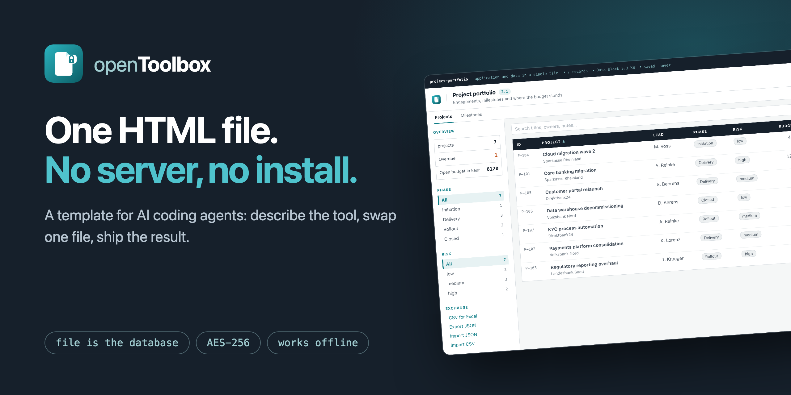
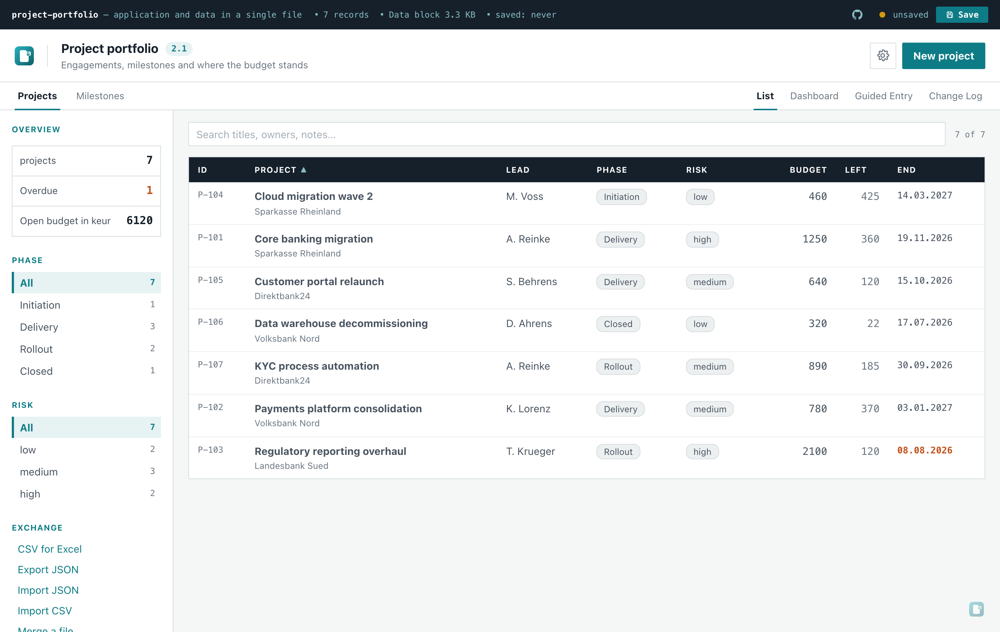
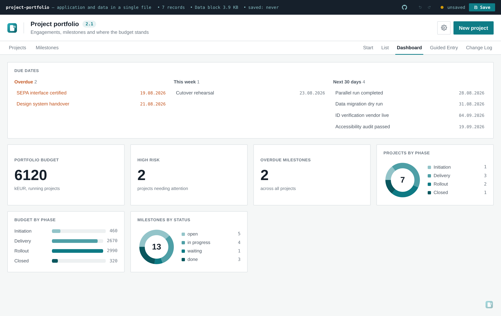

# openToolbox

[English](README.md) · [Deutsch](README.de.md) · [中文](README.zh.md) · [Español](README.es.md) · [Français](README.fr.md) · **日本語** · [Português](README.pt.md)

**動く社内ツールを、HTML ファイル 1 つとして届ける。サーバー不要、インストール不要、ネットワーク不要。**

openToolbox は、持ち運ばれることが前提の小さな社内ツール——メール、USB メモリ、共有ドライブで受け渡され、
制限の厳しい業務用ノート PC でダブルクリックすれば動く——のためのテンプレートです。このファイルは
アプリケーションであると同時に**データベースそのもの**です。保存すると、データを埋め込んだ新しい HTML
ファイルが書き出されます。

とりわけ次のような使い方のために作られています。

> 「openToolbox をベースに、サプライヤー監査を追跡するツールを作ってほしい」

AI コーディングエージェントにこのリポジトリを指し示すだけで、必要なものは揃います。フレームワーク本体と、
何を尋ね、どのファイルを変更すべきかを記した [`AGENTS.md`](AGENTS.md) です。

[`plugin/`](plugin/) の skill を入れれば、もう一歩短くなります。一度インストールすれば任意のディレクトリで欲しいツールを説明するだけで、エージェントがテンプレートを自分で取ってきます。Claude Code と Codex は同じ `SKILL.md` を読みます — 導入方法は [`plugin/README.md`](plugin/README.md)。必須ではなく、上の一文だけでも動きます。

---

## まず見てみる

[**ライブデモを開く**](https://m-dohmen.github.io/openToolbox/demos/) — 同じフレームワークが 6 つの
ツールとして動きます。プロジェクトポートフォリオから包装材登録まで。または [`docs/demos/`](docs/demos/)
から任意のファイルをダウンロードしてダブルクリックしてください。同じファイルで、サーバーは介在しません。



相互に参照し合う 2 種類のレコード、計算列、件数を示すフィルター、そしてタイトル横のバージョン表示。
以上すべてが `src/domain.js` という 1 つのファイルから生成されています。



ダッシュボードは 2 種類のレコードにまたがって集計します。**チャートライブラリを使わず**に描画——棒は CSS
の幅、リングは 1 つの SVG 円です。どちらのビューもそのまま整った PDF として印刷できます。

---

## 何が手に入るか

- **ファイル 1 つ。** 約 240 KB、自己完結。ダブルクリックで動きます。LAN ケーブルを抜いても動作し、
  唯一失われるのは[利用カウンター](#利用カウンター)だけ。しかもそれは目に見えるスイッチ 1 つでオフにできます。
- **ファイルがデータベース。** 保存するとレコードを埋め込んだ新しい HTML が書き出されます。バックエンドなし、
  ブラウザストレージなし、同期なし。
- **任意で暗号化。** AES-256-GCM、鍵は PBKDF2 で 310,000 回の反復により導出。パスフレーズがなければ
  ファイルはただの塊です。
- **任意で AI アシスタント。** OpenAI 互換の任意のエンドポイントに向けられます。データを読み、添付ファイルを
  追加の文脈として受け取り、明示的な指示があったときにのみ変更を提案します。適用前に必ず承認を求めます。
- **ブランディング可能。** 5 色、製品名、SVG ロゴ。すべてアプリ内で変更でき、ファイルとともに保存されます。
- **ライト／ダークモード**、キーボードショートカット、CSV・JSON エクスポート、スマートフォン幅まで対応。
- **列マッピング付き CSV インポート。** 実データを打ち直さずに取り込めます。
- **2 つの UI 言語**（英語・ドイツ語）。設定はファイルとともに移動します。
- **複数のレコード種別とその関連。** 1 種類では足りない場合に。
- **ダッシュボードと印刷用スタイル。** 分析はたいていスライドか添付資料で終わるからです。
- **ダッシュボードの期日ウィジェット。** スキーマのフィールド 1 つで有効化——期限超過・今週・今後 30 日を、
  それを宣言したすべてのエンティティ横断で集計します。
- **変更履歴。** 保存のたびに日時・バージョン・変更内容が記録されます。
- **埋め込まれたサンプルプロンプト。** 受け取った人がこのページを読まなくてもツールを改修させられます。
- **設定ページのロック。** データ入力だけの人の手に渡ったツールが、うっかり設定を変えられないようにします。
- **編集できるヘッダー行と最大 5 個のリンク。** 上部の暗いバーに、ツールの傍らにあるもの（リポジトリ、社内の置き場、チケット）への導線を置けます。
- **フィールドをまたぐ検証ルール。** 入力フォーム、CSV 取り込み（ウィザードの CSV ステップと JSON 取り込みを含む）、AI が提案する変更のすべてで同じチェックが働きます。
- **ガイド付き入力ウィザード。** ファイルを直接ウィザードで開く受付モードもあり、1 件だけ報告する相手に向いています。
- **返ってきたコピーの統合。** レコード単位で、変更はフィールドごとに新旧を並べて確認できます。
- **読み取り専用コピーの書き出し**（サイドバーのエクスチェンジ・グループ）：現在のファイルから
  別の HTML ファイルを生成し、ファイル名は `<fileStem>-report-<YYYY-MM-DD>.html`。
  保存・元に戻す・やり直し・新規・ウィザード・設定ページ・AI 提案・取り込み・統合・行編集ドロワー
  など、すべての書き込み面を取り除きます。ファイルバー上のバナーにバージョンと書き出し日時を
  表示して保存できないことがひと目で分かるようにし、元のファイルの変更履歴には「読み取り専用
  コピーを書き出し」という記録が残り、次回の保存時にディスクへ書き込まれます。1 つのシングル
  ファイルビルドが両方を生成し、Vite のエントリは 1 つのままです。
- **フィールド単位の変更履歴。** 保存のたびに自動で差分を取り、どのレコードのどの項目が何から何に変わったかを残します。
- **容量の上限が見える添付ファイル。** メールで送れなくなったツールは、もうこのツールではないからです。
- **編集できるスタートページ。** 表を見せる前に、ファイル自身が「これは何か」を説明します。
- **セッション内の元に戻す/やり直し。** 作成・編集・削除のすべてに対応し、Ctrl/Cmd+Z と Ctrl/Cmd+Y、
  またはファイルバーの2つのボタンで操作できます。
- **全エンティティの全フィールドを対象とするグローバル検索。** リアルタイムで絞り込み、タブにヒット数を表示、
  表内では一致部分をハイライトします。サイドバーにはフィールド型ごとのフィルターと削除可能なチップ付き —
  セッション限りで、ファイルには保存されません。
- **エンティティリストのどの列見出しもクリックでソート可能。** 1回で昇順、もう1回で降順、3回目でデータブロック順に
  戻ります。比較はフィールド型に従い（数値は数値として、日付は時系列に）、空の値は常に最後に置かれます。
- **レコードの複製に対応。** 表の行または開いたフォームから実行：全フィールド値を引き継ぎ、タイトルにはローカライズされた
  接尾辞が付き、コピーは固有の ID を持ちます。手動作成と同じ経路——取り消しスタック、変更履歴、書き込みは次回保存時。
- **複数選択による一括保守。** 行ごと、Shift+クリックでの範囲選択、表示中の全行を一括で選択。
  アクションバーから列挙フィールドの値を一括設定、件数確認つきの一括削除ができます。1 回の操作が履歴の
  1 ステップで、Ctrl+Z 1 回で元通り。
- **ダッシュボードの指標カード。** スキーマが `metrics` を宣言すると、各宣言がカードになります：`count`（フィルタ任意）、
  `sum(フィールド)`、`avg(フィールド)`（数値フィールドのみ）。描画時にローカル計算し、データには書き込まない。クリックでそのエンティティのリストへジャンプ。無効な宣言は黙って無視されず、理由付きで拒否されます。
- **計算フィールド (`computed`)。** スキーマに `compute: (record) => value` を書くと、レコードごとに描画時に
  算出され、フィールド単位でメモ化されます。**ファイルには書き込まれません**——保存された導出値は入力が変わった
  瞬間に古くなり、誰も気づきません。テーブル列・並べ替え・指標カードの `sum`/`avg`・CSV エクスポートに対応。
  フォームでは読み取り専用で、AI が書き込もうとすれば名指しで拒否されます。
- **保存ビュー。** スキーマに `views` を宣言すると、検索フィールド横のドロップダウンに名前付き
  の検索＋フィルタ＋並べ替えが現れ、ワンクリックで適用できます。ユーザーが追加したビューと開始
  ビューはデータブロックに保存され、ファイル同士を突き合わせたときは同じ名前のものは最後の書
  き込みが勝ちます。

## クイックスタート

```bash
git clone https://github.com/m-dohmen/openToolbox
cd openToolbox
npm install
npm run build     # → dist/index.html
```

`dist/index.html` をブラウザで開くだけです。

## 自分のツールを作る

業務ドメインに固有のものはすべて **1 つのファイル** `src/domain.js` にあります。差し替えて、ビルドし直せば
完了です。

```js
export const SCHEMA = {
  singular: 'risk',
  plural: 'risks',
  titleField: 'name',
  list: ['name', 'owner', 'review', 'likelihood', 'impact'],
  facets: ['likelihood', 'category'],
  fields: [
    { key: 'name', label: 'リスク', type: 'text', required: true },
    { key: 'category', label: '分類', type: 'enum', values: ['業務', '法務', 'IT'] },
    { key: 'review', label: '見直し日', type: 'date' },
    { key: 'impact', label: '影響度', type: 'number' },
  ],
}
```

フィールドは保存する代わりに**計算で求める**こともできます。

```js
{ key: 'score', label: 'リスク値', type: 'computed', compute: (r) => r.likelihood * r.impact }
```

`compute(record)` は各レコードについて描画パスごとに 1 回だけ実行され、結果はページのライフ
タイム中そのレコード上にメモ化されます。千件のレコードを並べ替え・検索・出力しても、レコードと
フィールドごとに 1 回ずつの呼び出しで済み、パスごとに波のように増えることはありません。結果が
**レコードに書き込まれることはありません**。それこそが要点です。導出値を保存してしまうと、入力
のどれかが変わった瞬間に古くなり、しかも誰も気づきません。それでも並べ替えも検索もでき、概要欄
で合計され、CSV エクスポートにも現れます。フォームでは読み取り専用で、AI にもそう伝えられ、
書き込もうとすれば名指しで拒否されます。

`compute(record)` が例外を投げると、フィールドはダッシュとして描画され、コンソールには
エンティティ・フィールド・レコード id・エラーメッセージの一意な組み合わせごとに**ちょうど 1 回**
警告が出ます。テーブルは止まらず、同じ組み合わせが 2 度警告を出すこともありません。

`compute` が数値を返す computed フィールドは、閉じられた `sum(field)` / `avg(field)` 指標カタログ
において実数値フィールドの代わりを務めます。`totalField` がすでに受け入れているのと同じ扱いです。

このスキーマだけで、テーブルの列、編集フォーム、サイドバーのフィルター、CSV エクスポート、AI モデルへ送る指示、
そしてモデルが返してくる提案の検証まで、すべてが生成されます。

## 複数のレコード種別と関連

ほとんどのツールはレコード種別 1 つで足ります。相互に参照し合う種別が実際に 2 つ以上あるとき——サプライヤーと
その証明書、プロジェクトとそのマイルストーン——`ENTITIES` をエクスポートし、相手を指す側に
`type: 'reference'` のフィールドを追加します。

参照フィールドはフォームでは対象レコードのドロップダウンとして、テーブルでは対象のタイトルを表示する
クリック可能なチップとして描画されます。クリックすればその種別に切り替わり、該当レコードが開きます。まだ参照
されているレコードの削除はブロックされ、何が参照しているかがメッセージに示されます。

上のデモの元になっている `examples/portfolio.domain.js` は、全機能を一度に使っています。

## データの取り込み

**列マッピング付きの CSV インポート。** ファイルを選ぶと、検出された各列がフィールドのドロップダウンと並んで
表示されます。見出しがフィールドのラベルまたはキーと一致する列は、大文字小文字と約物を無視して自動選択されます。
残りは手作業で割り当て、割り当てなかった列は取り込まれません。既存に追加するか、すべて置き換えるかを選べます。

区切り文字（`;`、カンマ、タブ）、引用符の扱い、先頭の BOM はファイル自体から判別されるため、Excel からの
エクスポートは下準備なしでそのまま使えます。各セルは AI の提案と同じ型チェックを通ります。**何も黙って失敗
しません**——結果画面は各指摘を行番号とともに示し、あるセルの値が不正でもその行の残りはそのまま取り込まれ、
タイトルのない行は中途半端に取り込まれるのではなくスキップされます。

識別子は常にアプリケーションが採番し、ファイルから読み取ることはありません。

## バージョン番号と変更履歴

**バージョン**は設定内の自由記述です——`1.4`、`2026-Q3`、`運営委員会向け最終版` など。タイトル横にバッジとして
表示され、保存時のファイル名にも組み込まれます（`project-portfolio-2.1-2026-08-15.html`）。添付が 4 つある
メールのやり取りでも、開かずに正しいファイルを見分けられます。

**変更履歴**は保存ごとに 1 件を記録します。タイムスタンプ、バージョン、そして保存時の短いダイアログで入力する
メモです。これらの項目は設定側ではなくデータ側に置かれます。したがって暗号化されたファイルでは、履歴は暗号化
された封筒の**内側**にあります。「監査指摘を受けて予算を修正」といったメモが本来あるべき場所です。

これがファイル内部の変更履歴です。プロジェクト単位のリリース履歴——openToolbox 自身のどのバージョンで何が
変わったか——については、リポジトリ直下の [`CHANGELOG.md`](CHANGELOG.md) と
[GitHub リリース](https://github.com/m-dohmen/openToolbox/releases) を参照してください。アプリ内の変更
履歴は「このファイルが何をしたか」、Changelog は「openToolbox が何をしたか」に答えます。

## サンプルプロンプト

ビルドされたファイルは、自身の変更方法を自ら説明します。ふつう手を入れたくなる箇所——ヘッダー、テーブル、
フィルター、ダッシュボード、編集フォーム、CSV インポート、AI 欄——に注意色のボックスが現れ、その部分が何から
生成されているかを述べ、AI エージェントにそのまま渡せるプロンプトをコピーボタン付きで提示します。

狙いは、ファイルを受け取った人がこのページを読んだことがなくても、`src/domain.js` の存在を知らなくても、
ツールを改修させられるようにすることです。

既定では有効です。テンプレートの仕事は教えることだからです。**データ入力だけを行う相手に完成品を渡す前には
オフにしてください**——その人にとってこれらのボックスは雑音でしかありません。

## なぜ 1 ファイルなのか

規制業種や大企業で繰り返し現れる 3 つの制約があります。

- 小さなツールをホスティングするには、サーバー、URL、運用責任者、そしてたいていはセキュリティレビューが要る。
- 何かをインストールするには、利用者が持っていない管理者権限が要る。
- データはその端末から出てはならない。

HTML ファイル 1 つは、この 3 つすべてを回避します。そして自身について正直です。利用者はソース全文を読めますし、
知らないうちに変わってしまうサービスも存在しません。

## 設定をロックする

設定 → セキュリティ → *設定を保護* で言葉をひとつ設定すると、そのページのすべての操作要素が無効になります。項目は**表示されたまま、値も読めるまま**です。「今はやめておいて」であって「見せられない」ではありません。同じ言葉でそのセッションのあいだだけ再び有効になり、ファイルを開き直せばまたロックされます。作成者が一度保存しただけで保護が黙って消える、ということはありません。

**これは操作ミスへの備えであって、セキュリティ境界ではありません。** ファイルを持つ人はコードも持っており、ロックの記録はテキストエディタでデータブロックから削除できます。スイッチにかぶせたフタです。本当に読ませてはいけないものには暗号化を使ってください。そちらは本物です。

言葉はパスワードでもありません。平文でファイルに残らないようソルト付き SHA-256 のダイジェストとして保存されますが、入力欄はあえてそのまま表示します。フタのために本物のパスワードを使い回すべきではないからで、「123」で十分です。複雑さの規則はありません。

## 利用カウンター

ビルドされたファイルの中で、自発的にネットワークへ出る唯一の箇所です。起動時に GET リクエストを 1 回だけ送り、
**そのツールの種類**（`SCHEMA.singular`、たとえば `action item`）を伝えます。それだけです。レコードも、
フィールドの内容も、ファイル名も、入力された内容も送りません。

このようなファイルは、作った本人以外の手に渡ります。だからこその 3 つの意図的な設計です。

- **エンドポイントは目に見える編集可能な設定**で、テンプレート作者のカウンターが初期値として入っています。
  自分のものに向けることも、欄を空にして一切数えないこともできます。設定はファイルとともに移動します。
- **ラベル付きのスイッチ**として「設定 → セキュリティ」にあり、送信先アドレスがすぐ隣に書かれています。
  隠しピクセルではありません。
- **パスが運ぶのはツールの種類であって、ファイル名ではありません。** ファイル名は受け取った人が変更でき、実際に
  顧客名を含むことがあります。それを第三者へ送ることは、ファイルの受け取り手に属する情報を漏らすことになります。

カウンターをオフにし、AI 連携もオフにすれば、このファイルはネットワーク接続を**一切**開きません。ブラウザの
ネットワークタブで確認でき、テストスイートでも保証されています。

## 知っておくべき制限

- **保存しなければ失われます。** 自動保存はありません——保存先ファイルがない以上、あり得ないのです。ファイルバーの
  黄色い点と、タブを閉じるときの確認だけが安全網です。Ctrl/Cmd+S で保存します。
- **1 台に 1 ファイル。** マルチユーザーモードはありません。2 人が同じファイルを別々に編集すれば、2 つの真実が
  生まれます。
- **メールゲートウェイは `.html` 添付をしばしば遮断します。** zip にするかファイル転送を使い、本当に必要になる前に
  一度ダミーで経路を試しておいてください。
- **暗号化が守るのはデータであって、アプリケーションへのアクセスではありません。** ローカルで動くファイル内の
  ロールやビューは見た目だけのものです。ファイルを持つ人はコードも持っています。

## ライセンス

Apache License 2.0。ソースファイルには `SPDX-License-Identifier` ヘッダーが付いています。

依存関係: Preact (MIT)、Vite (MIT)、テスト専用の Playwright (Apache 2.0)。ビルドされたファイルは実行時に
何も読み込みません。

---

> **この翻訳について**: 正となるのは[英語版 README](README.md) です。相違がある場合はそちらが優先されます。
> 詳細なリファレンス（アーキテクチャ、AI 連携の内部動作、セキュリティ）は
> [Wiki](https://github.com/m-dohmen/openToolbox/wiki) にあり、英語のみです。


