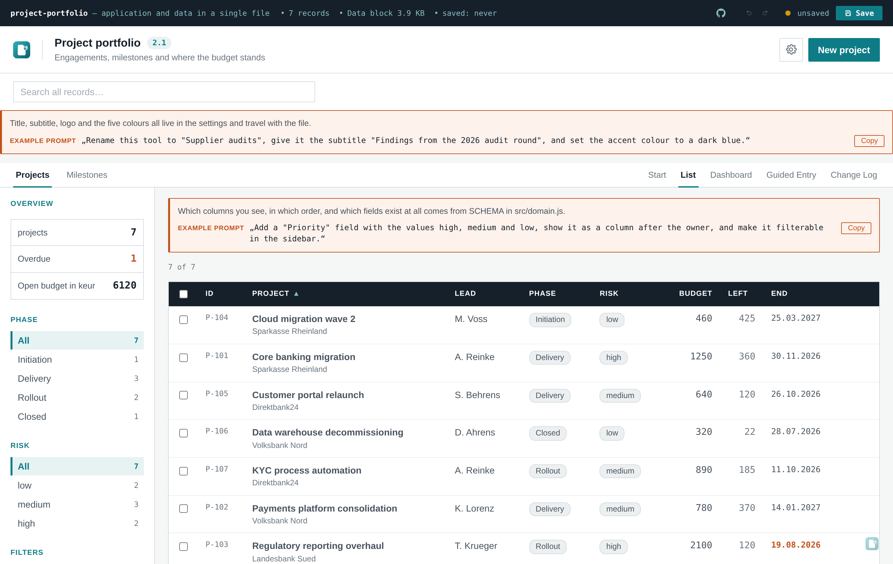
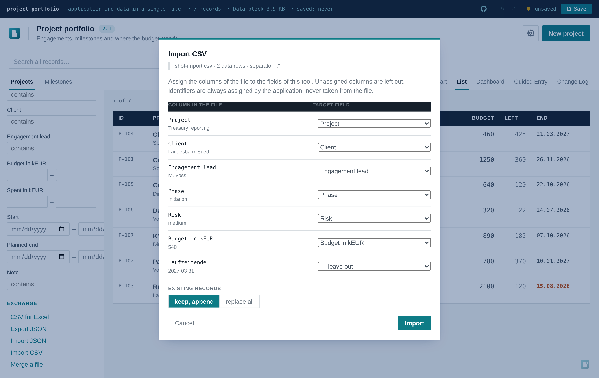
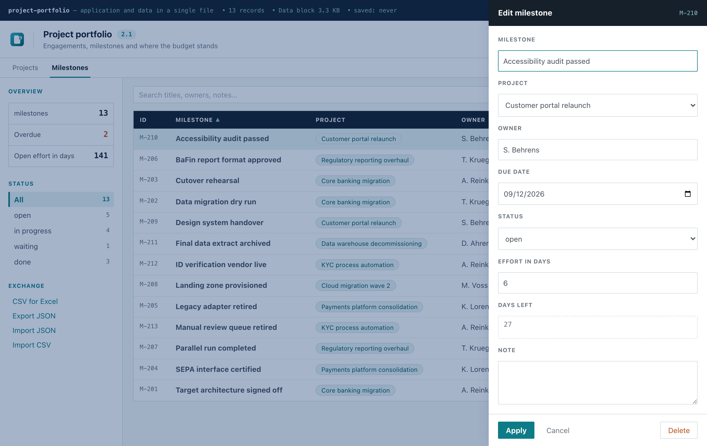
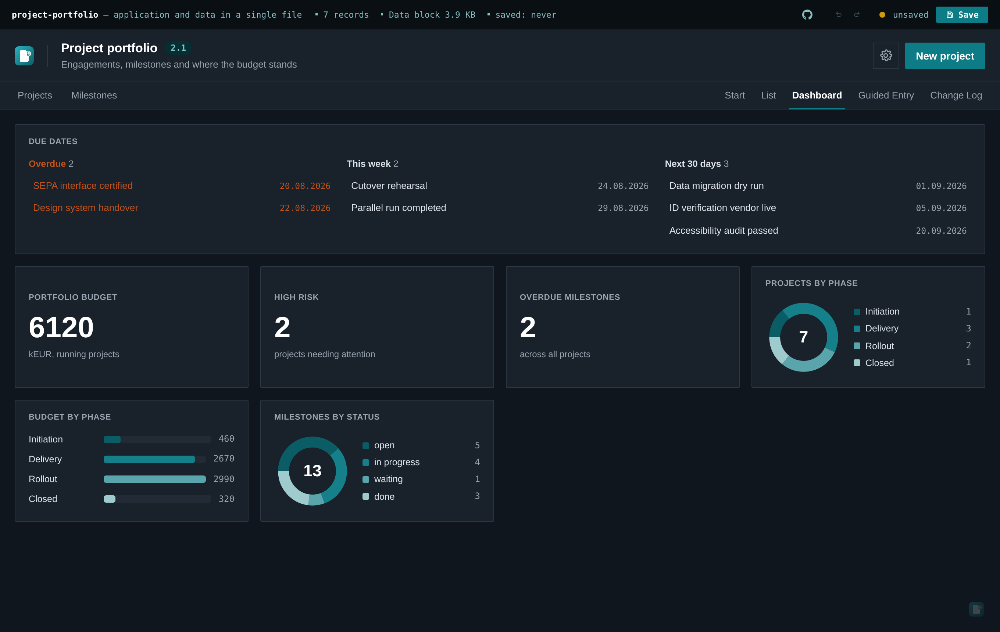
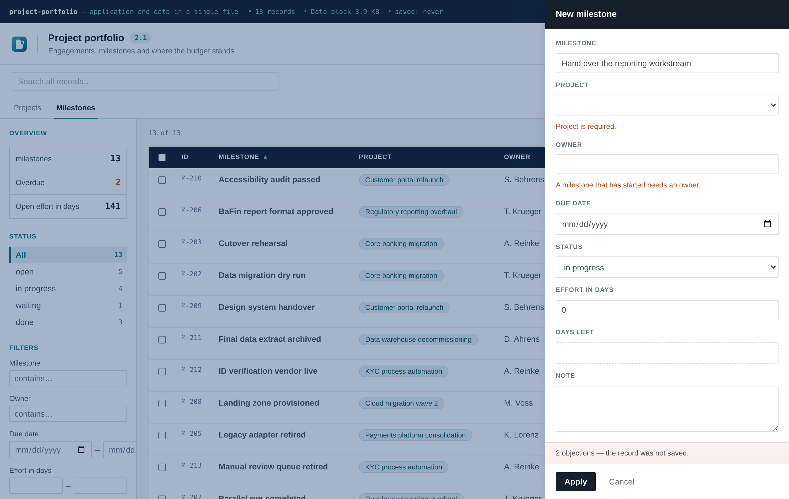
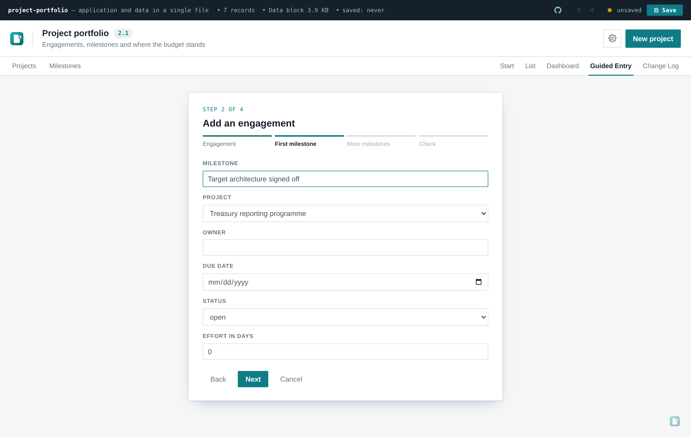
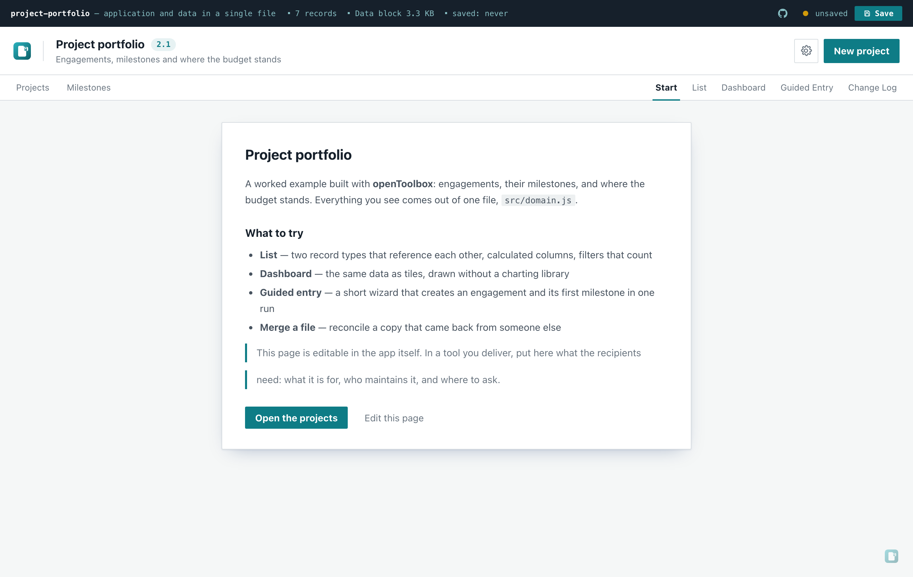
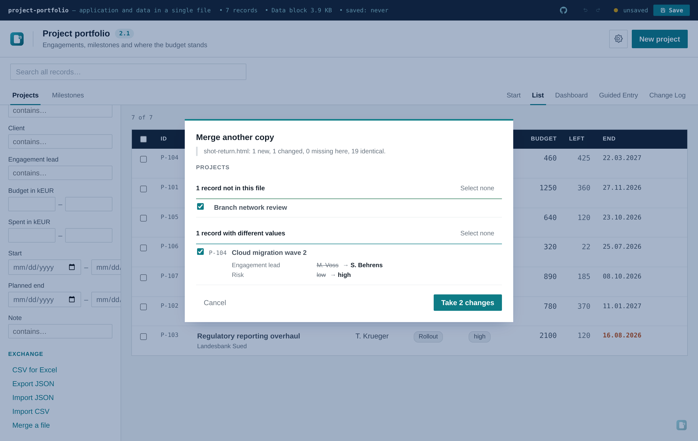

# openToolbox

**English** · [Deutsch](README.de.md)&nbsp;· [中文](README.zh.md)&nbsp;· [Español](README.es.md)&nbsp;· [Français](README.fr.md)&nbsp;· [日本語](README.ja.md)&nbsp;· [Português](README.pt.md)

**Ship a working tool as a single HTML file. No server, no install, no network.**

openToolbox is a template for small internal tools that need to travel — by email, USB stick or
shared drive — and run by double-click on a locked-down corporate laptop. The file *is* the
application and the database at the same time. Saving writes a new HTML file with the data embedded
in it.

It is built for one workflow in particular:

> "Build me a tool for tracking supplier audits, based on openToolbox."

Point an AI assistant at this repository and it has everything it needs — the framework, and
[`AGENTS.md`](AGENTS.md) telling it exactly what to ask and which file to change.

---

## See it

[**Six live demos**](https://m-dohmen.github.io/openToolbox/demos/) — the same framework as six
different tools. Or download any of them from [`docs/demos/`](docs/demos/) and double-click; same
file, no server involved either way.

| Demo | The problem it takes on | Shape |
| --- | --- | --- |
| [Project portfolio](https://m-dohmen.github.io/openToolbox/demos/portfolio/)<br><sub>Build prompt: [de](https://m-dohmen.github.io/openToolbox/demos/portfolio/generating_prompt_de.md)&nbsp;· [en](https://m-dohmen.github.io/openToolbox/demos/portfolio/generating_prompt_en.md)&nbsp;· [es](https://m-dohmen.github.io/openToolbox/demos/portfolio/generating_prompt_es.md)&nbsp;· [fr](https://m-dohmen.github.io/openToolbox/demos/portfolio/generating_prompt_fr.md)&nbsp;· [pt](https://m-dohmen.github.io/openToolbox/demos/portfolio/generating_prompt_pt.md)&nbsp;· [zh](https://m-dohmen.github.io/openToolbox/demos/portfolio/generating_prompt_zh.md)&nbsp;· [ja](https://m-dohmen.github.io/openToolbox/demos/portfolio/generating_prompt_ja.md)</sub> | Engagements, milestones, budget variance | 2 record types, money |
| [Verpackungsregister](https://m-dohmen.github.io/openToolbox/demos/ppwr-packaging/)<br><sub>Build prompt: [de](https://m-dohmen.github.io/openToolbox/demos/ppwr-packaging/generating_prompt_de.md)&nbsp;· [en](https://m-dohmen.github.io/openToolbox/demos/ppwr-packaging/generating_prompt_en.md)&nbsp;· [es](https://m-dohmen.github.io/openToolbox/demos/ppwr-packaging/generating_prompt_es.md)&nbsp;· [fr](https://m-dohmen.github.io/openToolbox/demos/ppwr-packaging/generating_prompt_fr.md)&nbsp;· [pt](https://m-dohmen.github.io/openToolbox/demos/ppwr-packaging/generating_prompt_pt.md)&nbsp;· [zh](https://m-dohmen.github.io/openToolbox/demos/ppwr-packaging/generating_prompt_zh.md)&nbsp;· [ja](https://m-dohmen.github.io/openToolbox/demos/ppwr-packaging/generating_prompt_ja.md)</sub> | EU packaging regulation: the data sits with your suppliers, not with you | 2 record types, attachments |
| [Verarbeitungsverzeichnis](https://m-dohmen.github.io/openToolbox/demos/gdpr-processing/)<br><sub>Build prompt: [de](https://m-dohmen.github.io/openToolbox/demos/gdpr-processing/generating_prompt_de.md)&nbsp;· [en](https://m-dohmen.github.io/openToolbox/demos/gdpr-processing/generating_prompt_en.md)&nbsp;· [es](https://m-dohmen.github.io/openToolbox/demos/gdpr-processing/generating_prompt_es.md)&nbsp;· [fr](https://m-dohmen.github.io/openToolbox/demos/gdpr-processing/generating_prompt_fr.md)&nbsp;· [pt](https://m-dohmen.github.io/openToolbox/demos/gdpr-processing/generating_prompt_pt.md)&nbsp;· [zh](https://m-dohmen.github.io/openToolbox/demos/gdpr-processing/generating_prompt_zh.md)&nbsp;· [ja](https://m-dohmen.github.io/openToolbox/demos/gdpr-processing/generating_prompt_ja.md)</sub> | GDPR Art. 30 — twelve people hold the answers | intake mode, enum-heavy |
| [Prüfbuch Betriebsmittel](https://m-dohmen.github.io/openToolbox/demos/equipment-testing/)<br><sub>Build prompt: [de](https://m-dohmen.github.io/openToolbox/demos/equipment-testing/generating_prompt_de.md)&nbsp;· [en](https://m-dohmen.github.io/openToolbox/demos/equipment-testing/generating_prompt_en.md)&nbsp;· [es](https://m-dohmen.github.io/openToolbox/demos/equipment-testing/generating_prompt_es.md)&nbsp;· [fr](https://m-dohmen.github.io/openToolbox/demos/equipment-testing/generating_prompt_fr.md)&nbsp;· [pt](https://m-dohmen.github.io/openToolbox/demos/equipment-testing/generating_prompt_pt.md)&nbsp;· [zh](https://m-dohmen.github.io/openToolbox/demos/equipment-testing/generating_prompt_zh.md)&nbsp;· [ja](https://m-dohmen.github.io/openToolbox/demos/equipment-testing/generating_prompt_ja.md)</sub> | Recurring equipment tests and the date nobody can find afterwards | dates and intervals |
| [Sanierung](https://m-dohmen.github.io/openToolbox/demos/renovation-quotes/)<br><sub>Build prompt: [de](https://m-dohmen.github.io/openToolbox/demos/renovation-quotes/generating_prompt_de.md)&nbsp;· [en](https://m-dohmen.github.io/openToolbox/demos/renovation-quotes/generating_prompt_en.md)&nbsp;· [es](https://m-dohmen.github.io/openToolbox/demos/renovation-quotes/generating_prompt_es.md)&nbsp;· [fr](https://m-dohmen.github.io/openToolbox/demos/renovation-quotes/generating_prompt_fr.md)&nbsp;· [pt](https://m-dohmen.github.io/openToolbox/demos/renovation-quotes/generating_prompt_pt.md)&nbsp;· [zh](https://m-dohmen.github.io/openToolbox/demos/renovation-quotes/generating_prompt_zh.md)&nbsp;· [ja](https://m-dohmen.github.io/openToolbox/demos/renovation-quotes/generating_prompt_ja.md)</sub> | Three quotes per trade, and where the budget actually stands | 2 record types, money |
| [Klassenfahrt](https://m-dohmen.github.io/openToolbox/demos/school-trip/)<br><sub>Build prompt: [de](https://m-dohmen.github.io/openToolbox/demos/school-trip/generating_prompt_de.md)&nbsp;· [en](https://m-dohmen.github.io/openToolbox/demos/school-trip/generating_prompt_en.md)&nbsp;· [es](https://m-dohmen.github.io/openToolbox/demos/school-trip/generating_prompt_es.md)&nbsp;· [fr](https://m-dohmen.github.io/openToolbox/demos/school-trip/generating_prompt_fr.md)&nbsp;· [pt](https://m-dohmen.github.io/openToolbox/demos/school-trip/generating_prompt_pt.md)&nbsp;· [zh](https://m-dohmen.github.io/openToolbox/demos/school-trip/generating_prompt_zh.md)&nbsp;· [ja](https://m-dohmen.github.io/openToolbox/demos/school-trip/generating_prompt_ja.md)</sub> | 28 forms out, 19 back, and the sheet nobody may see | states not numbers |

**Every demo ships a build prompt.** `docs/demos/<slug>/generating_prompt_<lang>.md` is the complete
functional specification of that tool as Markdown — fields, types, calculated formulas, validation
rules, dashboard tiles, wizard steps, defaults and start page. Hand it to an AI agent together with
this repository and you get that application back. Seven languages each; the *instructions* are
translated, the field labels and rule messages are not, because they are what the tool actually
shows.

They are generated from the domains themselves (`npm run prompts`), so a prompt cannot drift away
from the example it describes.

The screenshots below are from the project portfolio.


Two record types that reference each other, calculated columns, filters that count, and a version
badge next to the title. Everything you see comes out of one file, `src/domain.js`.


The dashboard reports across both record types. Drawn without a charting library — the bars are CSS
widths and the ring is one SVG circle. Both views print to a clean PDF.

<table>
<tr>
<td width="50%"></td>
<td width="50%"></td>
</tr>
<tr>
<td><b>The file explains itself.</b> Hint boxes carry a ready-made prompt for changing that
part of the tool. One switch turns them off before you hand the file to someone who only uses it.</td>
<td><b>Real data goes in via CSV</b>, with a column-mapping step. Separator and quoting are
detected; every cell runs through the same type check as an AI-proposed change.</td>
</tr>
<tr>
<td></td>
<td></td>
</tr>
<tr>
<td><b>The edit form is generated</b> from the schema, including the dropdown that resolves a
reference to another record type and read-only calculated fields.</td>
<td><b>Light and dark</b>, stored with the file. Category shades reverse direction in dark mode so
neither end of the range disappears.</td>
</tr>
<tr>
<td></td>
<td></td>
</tr>
<tr>
<td><b>Rules decide when a record may be saved</b> — here a milestone in progress without an owner.
The same rule rejects the row on CSV import and is handed to the AI as a constraint.</td>
<td><b>Guided entry</b> walks a recipient through short steps. In step two the reference field
already offers the record drafted in step one — one run creates both.</td>
</tr>
</table>

---

**Single file · database in the file · optional AES-256 encryption · optional AI assistant ·
brandable (colours, logo, name) · bilingual interface (English, German) · light & dark mode ·
dashboard · CSV import · change log · version numbers.**

## What you get

- **One file.** ~90 KB, self-contained. Double-click, it runs. Pull the network cable, it still runs
  — the only thing it would miss is the [usage counter](#the-usage-counter), which is one visible
  setting away from off.
- **The file is the database.** Save writes a new HTML file with the records embedded. No backend,
  no browser storage, no sync.
- **Optional encryption.** AES-256-GCM, key derived through PBKDF2 with 310,000 rounds. Without the
  passphrase the file is a blob.
- **Optional AI assistant.** Point it at any OpenAI-compatible endpoint. It reads the data, takes
  file attachments as extra context and — on explicit instruction — proposes changes you approve
  before they are applied.
- **Brandable.** Five colours, product name and an SVG logo, all editable in the app and stored with
  the file. Export the configuration once and reuse it across every tool you build.
- **Light and dark mode**, keyboard shortcuts, CSV and JSON export, responsive down to phone width.
- **CSV import with column mapping**, so real data gets in without retyping it — see
  [Getting data in](#getting-data-in).
- **Two interface languages out of the box** (English, German), a setting that travels with the
  file. Adding a third is a small, mechanical change — see [Interface languages](#interface-languages).
- **Multiple entities and relationships**, when one record type isn't enough — see
  [Multiple entities and relationships](#multiple-entities-and-relationships).
- **Dashboard tiles and a print stylesheet**, because analysis usually ends in a slide or an
  appendix — see [Dashboard](#dashboard).
- **A due-date widget on the dashboard**, opt in with one schema field — overdue, this week, next
  30 days, across every entity that declares it — see [Due dates](#due-dates).
- **A change log**, filled on every save with date, version, your note and the field-level changes
  worked out automatically — see [Version numbers and change log](#version-numbers-and-change-log).
- **Attachments with a visible size budget**, because a tool you cannot email is not this tool —
  see [Attachments](#attachments).
- **Example prompts embedded in the file**, so whoever receives it can have it changed without
  reading this README — see [Example prompts](#example-prompts).
- **A lock on the settings page**, so a tool handed to someone who only enters data can't be
  reconfigured by accident — see [Locking the settings](#locking-the-settings).
- **An editable header line and up to five links** in the dark bar at the top, pointing at whatever
  sits next to the tool — see [The dark bar at the top](#the-dark-bar-at-the-top).
- **Validation rules across fields**, enforced identically in the form, the CSV import and
  AI-proposed changes — see [Building your own tool](#building-your-own-tool).
- **An editable start page**, so the file can explain itself before showing a table — see
  [The start page](#the-start-page).
- **A guided entry wizard**, and an intake mode that opens the file straight into it — see
  [Guided entry](#guided-entry).
- **Merging a copy that came back**, record by record, with a field-level diff — see
  [Merging a copy that came back](#merging-a-copy-that-came-back).

## Quick start

```bash
git clone https://github.com/m-dohmen/openToolbox
cd openToolbox
npm install
npm run build     # → dist/index.html
```

Open `dist/index.html` in a browser. That is the whole thing.

## Building your own tool

Everything domain-specific lives in **one file**: `src/domain.js`. Swap it, rebuild, done.

```js
export const SCHEMA = {
  singular: 'risk',
  plural: 'risks',
  titleField: 'name',
  list: ['name', 'owner', 'review', 'likelihood', 'impact'],
  facets: ['likelihood', 'category'],
  fields: [
    { key: 'name', label: 'Risk', type: 'text', required: true },
    { key: 'category', label: 'Category', type: 'enum', values: ['Operational', 'Legal', 'IT'] },
    { key: 'review', label: 'Review date', type: 'date' },
    { key: 'impact', label: 'Impact score', type: 'number' },
  ],
}
```

A field can also be **calculated** instead of stored:

```js
{ key: 'score', label: 'Risk score', type: 'computed', compute: (r) => r.likelihood * r.impact }
```

`compute(record)` runs on every render and the result is never written into the record — a stored
derivation goes stale the moment one of its inputs changes, and nobody notices. It still sorts,
searches, sums into the overview tile and lands in the CSV export like any other field; it is
read-only in the form, and the AI is told so and rejected by name if it tries to set one. The
shipped demo has one: *Days left*, counting down to the due date.

And conditions **between** fields go in `rules`:

```js
rules: [
  { when: (r) => r.status === 'done', require: ['owner'],
    message: 'An item that is under way needs an owner.' },
]
```

The value is the single place it runs: **the form, the CSV import and anything the AI proposes all
pass through the same check.** One rule in the schema hardens all three at once. In the form the
objection appears under the field and the save is refused; an offending CSV row is skipped and
named; the model is told the message up front and gets it back as the reason if it ignores it.
`required: true` on a field is enforced the same way — and a numeric `0` counts as filled, because
zero is usually a real answer.

That schema alone produces the table columns, the edit form, the sidebar filters, the CSV export,
the instructions sent to the AI model and the validation of anything the model proposes back.
`examples/` holds **seven complete domains**, each published as a
[live demo](https://m-dohmen.github.io/openToolbox/demos/). Copy the closest one over
`src/domain.js` and rebuild to watch the entire app change — that is usually faster than writing a
schema from a blank file. `risk-register.domain.js` is the plainest starting point.

### Attachments

`type: 'attachment'` puts an uploaded file in the record itself and it travels with the file like
everything else.

**The budget is part of the feature.** Attachments break the one promise this shape rests on — a
file you can send by email — so a meter in the dark bar shows used-of-limit and turns amber past
85 %, and an upload that would exceed the limit is refused when the record is applied, with the
numbers in the message. Default 5 MB total, 4 MB for any single file, editable in Settings → Data.

Attachments never reach the AI — the model sees the file name only, since one embedded PDF as
base64 would exceed the entire context window. The CSV export carries the name, not the content.
The stored MIME type is never used to render anything; downloads always go through a blob with a
`download` attribute.

## Multiple entities and relationships

Most tools need only one record type — the single `SCHEMA` export above. Once there are genuinely
two or more kinds of records that reference each other (suppliers and their certificates, projects
and their tasks), export `ENTITIES` instead: one entry per record type, each shaped like the
single-entity export above, plus a `type: 'reference'` field on whichever entity points at another.

```js
export const ENTITIES = {
  suppliers: { schema: { /* … */ }, uid, emptyRecord, seed, isDone, isOverdue },
  certificates: {
    schema: {
      /* … */
      fields: [
        { key: 'title', label: 'Title', type: 'text', required: true },
        { key: 'supplierId', label: 'Supplier', type: 'reference', entity: 'suppliers', required: true },
      ],
    },
    uid, emptyRecord, seed, isDone, isOverdue,
  },
}
```

A reference field renders as a dropdown of the target entity's records in the form and as a
clickable chip resolving to the referenced record's title in the table — click it, and the app
switches to that entity and opens the record. Deleting a record still referenced by another entity
is blocked, naming what references it. The AI assistant understands the relationship too: its
instructions describe every entity and how they connect, and it can name a referenced record by id
or by title text. `examples/suppliers-certificates.domain.js` is a minimal working example, and
`examples/portfolio.domain.js` — the one behind the [live demo](https://m-dohmen.github.io/openToolbox/demo/)
— is the full-dress version using every feature at once.

## The start page

A tool that lands straight on a table assumes you already know what it is. Usually the recipient
does not — they want a sentence on what it is for, who maintains it and where to ask. The app opens
on that page whenever it has text.



Edited in the app itself, in a small Markdown subset: headings, lists, quotes, a rule, `**bold**`,
`*italic*`, `` `code` `` and `[links](url)`. Everything else stays plain text — the text is parsed
into a tree and rendered as nodes, never inserted as HTML, so nothing written there can become
markup in a file that gets passed around.

Two things worth knowing. **The settings lock covers this page too** — protect the settings and the
edit button turns into a note saying so, because otherwise the protection would be half a measure.
And **the text lives with the settings**, so it sits outside the encrypted envelope and stays
readable before anyone unlocks the file: right for "what is this", wrong for anything confidential.

Empty text means there is no start page at all.

## Guided entry

The list plus the edit form assume you know the tool. Someone who receives the file to report *one*
thing should not have to sort out a table, a sidebar and seventeen fields first. A `WIZARD` export
gives them a sequence of short steps instead — without it the view does not exist.

```js
export const WIZARD = {
  title: 'Report an action item',
  steps: [
    { id: 'what', label: 'What', fields: ['title', 'area', 'note'] },
    { id: 'who', label: 'Who and when', fields: ['owner', 'due', 'status'] },
    { id: 'bulk', label: 'Several at once', type: 'csv',
      when: (drafts) => Boolean(drafts.records.title) },
    { id: 'check', label: 'Check', type: 'review' },
  ],
  done: { message: 'Thank you — that is recorded.', allowAnother: true },
}
```

Four step types, which is all it takes generically: `fields` renders a subset of the schema fields
with the same machinery and the same rules as the edit form; `csv` is the existing import as a step;
`review` is a summary generated from the schema; the closing screen comes from `done`. A `when`
hides a step that does not apply.

Two things make it more than a form:

- **The CSV step feeds the same run.** Rows are held and created together with the draft at the end,
  so abandoning the wizard halfway leaves nothing behind.
- **Drafts get their ids at the start**, so with several record types a reference field in step two
  can already point at the record from step one — one run creates a supplier and its certificate.

### Intake mode

Settings → Application → *Opens as* → **Guided entry** opens the file straight into the wizard and
hides the list, the entity tabs and the "New …" button. The same file becomes a form you send out:
the recipient fills it in, saves, mails it back. `mode: 'intake'` in `DEFAULT_SETTINGS` ships it
that way from the start.

## Dashboard

Optional, declared in `src/domain.js` as a `DASHBOARD` export. Without it, the view does not exist
and nothing in the interface changes.

```js
export const DASHBOARD = {
  tiles: [
    { type: 'stat',  measure: 'count', label: 'Action items', caption: 'in this file' },
    { type: 'stat',  measure: 'effort', filter: (r) => !isDone(r), label: 'Open effort' },
    { type: 'donut', groupBy: 'status' },
    { type: 'bar',   groupBy: 'area', measure: 'effort', label: 'Effort by area' },
  ],
}
```

Three tile types — `stat` (one number), `bar` (one bar per enum value) and `donut` (the same data
as a ring with a legend). `measure` is either `'count'` or a field key whose values get summed;
`filter(record)` narrows the set first; with `ENTITIES`, a tile can name the `entity` it reports on.

Drawn **without a charting library**: the bars are CSS widths and the ring is a single SVG circle
with `stroke-dasharray`. A charting library would multiply the size of a file that has to travel by
email, for four tile types. Category colours are derived from the tool's own accent colour — so a
rebranded tool recolours its dashboard by itself — and the shade direction flips in dark mode, or
one end of the range would disappear into the background.

Tiles report on their entity's **full** record set, not the filtered table view: a tile can belong
to a different entity than the one currently open, and "sometimes filtered, sometimes not" would be
unpredictable.

### Due dates

Set `dueDate` on a schema to a field key — a plain `date` field or a `computed` one, the same way
`totalField` names a number field — and a due-date widget appears at the top of the dashboard:

```js
export const SCHEMA = {
  // …
  dueDate: 'review',
}
```

Unlike the tiles above, this needs no `DASHBOARD` export at all — due-date tracking is common enough
on its own that it shows up the moment any entity declares it, tiles or none. Three groups, hidden
when empty: **overdue** (before today), **this week** (Monday through Sunday of the current local
calendar week) and the **next 30 days** after that. A record marked done by `isDone()` never appears
— finished work is not outstanding. Dates are read as local calendar days, not UTC instants, so a
`2026-08-20` due date doesn't slip a day west of Greenwich. With `ENTITIES`, the widget aggregates
across every entity that opts in, and clicking an entry jumps straight to that record. A domain that
never sets `dueDate` sees exactly its previous dashboard.

## Version numbers and change log

Two small features that matter once a file starts circulating.

**A version** is free text in Settings → Application — `1.4`, `2026-Q3`, `final for steering
committee`. It shows as a badge next to the title and is folded into the saved file name
(`project-portfolio-2.1-2026-08-15.html`), so the right file is identifiable in a mail thread
without opening it. Empty by default, and then nothing changes.

**The change log** writes one entry per save: timestamp, version, and a note you type in a short
dialog when saving. The Change log view lists them newest first with the notes still editable.

Each entry also carries **the field changes since the last save**, worked out automatically — which
record, which field, before and after, plus anything created or deleted. That answers the question
an audit actually asks, which is never "what did you do on the 14th" but "what exactly happened to
A-1041 between 1.2 and 1.4". Opening a record shows the same trail filtered to that record.

Deriving it rather than asking for it is deliberate: a log that depends on the writer's discipline
is incomplete exactly when it matters. A single entry is capped at 200 changes, and the remainder is
counted rather than silently dropped.

Entries live with the records, not with the settings — so in an encrypted file the log sits
**inside** the envelope, where notes like "budget corrected after the audit finding" belong. Switch
the log off in Settings and saving asks nothing.

### Who the copyright line belongs to

The notice at the bottom of the settings page is a free-text setting, because the tool you build
from this template is yours, not the template's. It ships as `© openToolbox` linking to the project,
with an optional link field of its own — replace both with your own or your client's. Underneath,
a fixed line reads `based on openToolbox · Apache License 2.0` and links back here.

## Example prompts

The built file explains how to change itself. At the places you would typically want to adjust —
the header, the table, the filters, the dashboard, the edit form, the CSV import, the AI dock — a
box in the attention colour states what generates that part and offers a ready-made prompt to hand
to an AI agent, with a copy button.

The point: whoever receives the file does not have to have read this README, or know that
`src/domain.js` exists, to get the tool changed. They copy a sentence and hand it to an agent.

It is on by default because the template's job is to teach. **Switch it off before handing a
finished tool to someone who only uses it** — there the boxes are noise. One toggle in
Settings → Appearance, and `examplePrompts: false` in `DEFAULT_SETTINGS` ships it off from the start.

## Printing

Both views have a print stylesheet, so `Ctrl`/`Cmd`+`P` produces a usable PDF for a meeting
appendix. The file bar, sidebar, search, chat dock, watermark and every button drop away; the table
repeats its header on each page and avoids breaking rows; dashboard tiles avoid breaking across
pages. Colour is forced on for bars, rings and status pills — there they carry information rather
than decoration, and browsers otherwise print them white.

## Using it with an AI assistant

Say something like:

> Build me a tool for tracking vendor certificates, based on openToolbox
> (https://github.com/m-dohmen/openToolbox).

The assistant reads [`AGENTS.md`](AGENTS.md), asks what a record looks like, writes `src/domain.js`,
runs the build and hands you the finished HTML file. `AGENTS.md` also lists the mistakes that break
a single-file build, so the assistant does not have to rediscover them.

### Install the skill and skip the first step

`AGENTS.md` only helps once the agent is already in this repository. The skill in
[`plugin/`](plugin/) is the entry point from outside: install it once, then describe the tool you
want in any directory and the agent fetches the template itself, runs the interview, builds and
hands over. Claude Code and Codex read the same `SKILL.md`.

```bash
claude plugin marketplace add m-dohmen/openToolbox
claude plugin install opentoolbox@opentoolbox
```

For Codex, copy `plugin/skills/opentoolbox-tool` into `~/.codex/skills/` — see
[`plugin/README.md`](plugin/README.md). Nothing about the skill is required; it is convenience, and
the prompt above works without it.

## Why single-file

Three constraints that keep coming up in regulated and corporate environments:

- Hosting a small tool means a server, a URL, an operations owner and usually a security review.
- Installing anything requires admin rights the user does not have.
- The data must not leave the machine.

A single HTML file sidesteps all three. It is also honest about what it is: the user can read the
entire source, and there is no service that can quietly change under them.

## How persistence works

`index.html` contains an empty data block:

```html
<script id="sb-payload" type="application/json">null</script>
```

On startup the app snapshots the untouched document source. On save it replaces just that block and
writes the result. Three write paths, in descending order of comfort: the previously chosen file
(File System Access API — no dialog from the second save on), a "Save as" dialog, or the downloads
folder. Chromium gets the first, Firefox and Safari the last.

There is deliberately **no browser storage**. `IndexedDB` and `localStorage` are unreliable under
`file://` — Chrome refuses `IndexedDB` when third-party cookies are blocked, and `localStorage` is
shared across all local files in some browsers. The embedded payload works everywhere.

## Locking the settings

A file that goes to someone who only enters data still has a full settings page in it — colours,
endpoints, the file name, the AI configuration. Nothing there needs to be touched, and a stray
click on any of it travels forward into every following save.

Settings → Security → *Protect settings* asks for a word and disables every control on the page.
The fields stay **visible with their values readable** — the point is "not now", not "not your
business". The same word enables them again for the current session; reopening the file locks them
again, so the protection does not quietly disappear after the author's first save.

**This is a guard against slips, not a security boundary.** Whoever has the file has the code, and
the lock entry can be deleted from the payload with a text editor. It is a lid over a switch. For
anything that genuinely must not be read, use the [encryption](#what-you-get) instead — that one is
real.

The word is not a password either. It is stored as a salted SHA-256 digest so it does not sit in
the file as plain text, but the input shows it openly on purpose: nobody should reuse a real
password for a lid, and `123` does the job. There is no complexity rule.

## The usage counter

The one thing in a built file that reaches the network on its own. On open it sends a single GET
to a counting endpoint with **the kind of tool this is** — `SCHEMA.singular`, e.g. `action item`.
That is all: no records, no field contents, no file name, no title, nothing anyone typed.

Three deliberate decisions, because a file like this gets passed on to people who did not build it:

- **The endpoint is a visible, editable setting**, not a constant baked into the code. It comes
  preset to the counter of whoever built the template. Point it at your own, or clear the field and
  nothing is counted. The setting travels with the file, so copies you hand to a client count where
  *you* decided — or nowhere.
- **It's a normal switch in Settings → Security**, labelled, with the endpoint spelled out next to
  it. Not a hidden pixel.
- **The path is the tool kind, never `fileStem`.** The file name is end-user editable and in
  practice carries client names (`kunde-xy-risikoregister`). Sending that to a third party would
  leak something that belongs to the file's recipient, so it is deliberately not sent.

Switch the counter off, leave the AI integration off, and the file opens **no** network connection
at all — verifiable in the network tab, and asserted by the test suite.

## The AI assistant

Switched off by default. While off, the AI integration opens no network connection at all — there
is no second way out.

**Compatibility is negotiated, not assumed.** "OpenAI-compatible" is a family of dialects, not a
standard. Current reasoning models require `max_completion_tokens` and reject a custom temperature;
older proxies only know `max_tokens`. The client starts with the broadest variant, reads what the
endpoint objects to out of the 400 response, adapts and retries — up to six attempts. The result is
stored with the file, so the next call gets it right the first time.

**CORS is the thing that will bite you.** From a local file the origin is `null`. The endpoint has
to allow it, which in practice means putting a proxy in front (LiteLLM, API Management, a function).
Direct calls to api.openai.com will not work. The error message says so rather than leaving you with
a blank console.

**Changes are proposals, not commands.** When asked to modify data the model appends a JSON block;
the application validates every operation against the schema — unknown fields dropped, enum values
checked, ids verified, new ids assigned by the app — and shows you the list before anything is
touched. Rejected operations are named, not silently swallowed.

**Keys are not stored by default.** If AI is enabled without a stored key, the file asks for it once
on open and offers to switch the integration off instead.

## Branding

Product name, logo and five colours are editable in the settings page and travel with the file.
Uploaded SVGs are sanitised first — scripts, `on…` handlers, `foreignObject` and external references
are stripped, and you are told what was removed. Export the configuration as JSON (without records,
without the API key) and load it into every other tool you build.

### The dark bar at the top

Two settings shape it. **Header line** replaces the text after the file name — leave it empty and
you get the translated standard line, which follows the interface language; fill it and your text
wins everywhere (`Muster GmbH · internal`).

**Links in the header** puts up to five icons on the right, next to the save button, each opening in
a new tab. It ships with one pointing at this repository; replace it with what sits next to *your*
tool — the client's Confluence space, a ticket board, the intranet folder. Each entry is an SVG
icon, a URL and a label that becomes the tooltip.

Both the icon and the URL are checked, because these travel with the file to people who did not
build it: icons run through the same sanitiser as the logo, and only `http`, `https` and `mailto`
addresses are rendered. A missing scheme is completed to `https`; a `javascript:` or `data:` URL is
dropped without display rather than written into an `href`.

## Interface languages

The interface ships in **English (default) and German**, selectable in Settings → Appearance →
Language. The choice travels with the file, exactly like the color scheme.

This is deliberately split into two layers that don't mix:

- **App chrome** — buttons, dialogs, toasts, the AI proposal review ("Updated A-123 — Status: open →
  done"). This is what the language toggle controls. It lives in one file, `src/i18n.js`: a flat
  `key → string` dictionary, one block per language.
- **Schema content** — field labels, enum values, seed data in `src/domain.js`. Whatever language you
  wrote them in is what stays on screen, regardless of the interface language. A German-only tool
  keeps its German column headers ("Fälligkeit", "Zuständig") even with the toggle set to English —
  translating live business data isn't a UI toggle's job, and mixing the two would make the schema
  layer depend on a locale it doesn't know about.

### Adding a language

Since the whole mechanism sits in one file with every string already translated once, adding a
language is small enough to hand an AI assistant as a single instruction:

> Add Italian as an interface language.

Everything it needs is right there: `src/i18n.js` documents the pattern in its header comment,
`LOCALES` and `LOCALE_LABELS` list what Settings offers, and all 229 keys in `STRINGS.en` already
have a `STRINGS.de` counterpart to translate from. Concretely, the change is:

```js
// src/i18n.js
export const LOCALES = ['en', 'de', 'it']
export const LOCALE_LABELS = { en: 'English', de: 'Deutsch', it: 'Italiano' }

const STRINGS = {
  en: { /* … */ },
  de: { /* … */ },
  it: {
    'app.settings': 'Impostazioni',
    'common.apply': 'Applica',
    // … one line per key, same shape as `en` — plain strings and small
    // functions like `(n) => `${n} record${n === 1 ? '' : 's'}`` for the
    // handful of keys that take arguments (counts, names, plurals).
  },
}
```

Nothing else in the codebase changes. Settings picks up the new option from `LOCALES` automatically,
every component already calls the generic `tr('some.key', ...args)`, and a key missing from a
work-in-progress translation falls back to English rather than breaking — so a partial translation
is safe to ship and finish later.

### How it's wired, for anyone extending it further

- `settings.locale` is a normal setting: stored with the file, defaults to `'en'`, rendered as a
  segmented control next to color scheme and row height.
- Every component builds a bound translator once — `const tr = translator(settings.locale)` — and
  calls `tr('key')` or `tr('key', ...args)` for the handful of keys that interpolate a value (a
  count, a filename, a field label).
- `src/lib/actions.js` (validating and describing AI-proposed changes) and `dialectSummary()` in
  `src/lib/ai.js` (the negotiated-dialect line in Settings) take the same `tr` — the sentences a user
  reads when reviewing an AI proposal are translated too, not just the surrounding chrome.
- What stays English on purpose: the instructions and schema description sent *to* the AI model
  (`buildInstructions`, `buildContext` in `src/lib/ai.js`). Models are most reliable in English
  regardless of the interface language, and the user never reads that text directly — only the
  model does.

## Merging a copy that came back

The structural weakness of a file-as-database: send it to five departments and five files come back.
Until now that meant retyping.

**Merge a file** (sidebar, or Settings → Data) reads a second copy of the same tool and compares it
record by record. Three groups, each with checkboxes: records only in the other file, records with
different values — shown field by field, before and after — and records missing there.



Nothing needs configuring; it works off the schema and the identifiers, so it is for two copies of
**the same tool**, not two arbitrary files. A record type the reading file does not know is named
and skipped, and an encrypted counterpart asks for its own passphrase.

One default is deliberate: **deletions are not preselected.** A record missing from the other copy
looks identical whether it was deleted there or the copy is simply older — and only one of those two
readings destroys data. Everything else is ticked, because taking the changes is the reason you
opened the dialog.

Merging changes the working set; the file still has to be saved afterwards.

## Getting data in

Three ways, all in the sidebar and in Settings → Data:

- **CSV import** with a column-mapping step. Pick a file, and the dialog lists every column it
  found next to a dropdown of the current entity's fields. Columns whose heading matches a field
  label or key are preselected (case and punctuation are ignored); anything else you assign by
  hand, and unassigned columns are left out. Choose whether to append to the existing records or
  replace them.

  Separator (`;`, `,` or tab), quoting and a leading BOM are detected from the file, so an Excel
  export works without a preparation step. Every cell runs through the same type check as an
  AI-proposed change: enum values are matched tolerantly, numbers and dates are validated, a
  reference field accepts either the target's id or its title text. **Nothing fails silently** —
  the result screen names every objection with its line number, a bad value in one cell leaves the
  rest of the row intact, and a row without a title is skipped rather than imported half-empty.

  Identifiers are always assigned by the application, never taken from the file — the same rule
  that applies to records the AI creates.

- **JSON import** — a flat array replaces the active entity's records; an object keyed by entity
  replaces several at once. This is the format `Export JSON` writes, so it round-trips.

- **The AI assistant**, on an explicit instruction, can create records from an attached document.
  See [The AI assistant](#the-ai-assistant).

## Limits worth knowing

- **Not saved means lost.** There is no autosave — without a target file there cannot be one. The
  amber dot and the tab-close prompt are the only safety net. Ctrl/Cmd+S saves.
- **One machine, one file.** No multi-user mode — two people editing the same file produce two
  truths. What there *is* since v0.4.0 is a way to reconcile them afterwards, record by record; see
  [Merging a copy that came back](#merging-a-copy-that-came-back). Live collaboration is still out
  of scope and always will be.
- **Mail gateways strip `.html` attachments** more often than not. Zip it or use a file transfer,
  and test the route once with a dummy before it matters.
- **Encryption protects the data, not access to the app.** Roles and views in a locally running file
  would be surface only — whoever holds the file holds the code. The
  [settings lock](#locking-the-settings) is exactly that kind of surface, and says so where it sits.

## Project layout

```
src/domain.js          the only file most tools need to change
src/app.jsx            shell, list, form, save logic
src/settings.jsx       settings page
src/dashboard.jsx      dashboard tiles (stat, bar, donut) — no charting library
src/hint.jsx           the example-prompt boxes
plugin/                installable skill for Claude Code and Codex (see plugin/README.md)
examples/              seven complete domains, ready to copy over src/domain.js
docs/demos/            the built demos, committed so they can be linked and downloaded
scripts/demos.mjs      the demo list: example, colours, start page, blurb
scripts/build-demo.mjs builds every entry of that list into docs/demos/<slug>/
scripts/demo-index.mjs builds the overview page docs/demos/index.html
scripts/build-prompts.mjs generates the build prompts from the domains, 7 languages
scripts/screenshots.mjs regenerates the images in this README
src/chat.jsx           AI assistant dock
src/brand.jsx          wordmark and uploaded logo
src/i18n.js            interface language dictionary (English, German)
src/tokens.css         colour and type primitives
src/styles.css         semantic roles and components
src/lib/payload.js     read and write the embedded data block
src/lib/crypto.js      PBKDF2 + AES-GCM
src/lib/lock.js        settings lock — a guard against slips, not a security boundary
src/lib/ai.js          endpoint client, dialect negotiation, context building
src/lib/actions.js     validation and application of AI-proposed changes
src/lib/entities.js    normalizes SCHEMA/ENTITIES, shared field type check, delete-guard helpers
src/lib/csv.js         CSV writer and reader (separator sniffing, RFC 4180 quoting)
src/lib/count.js       the usage counter — the only self-initiated network call in the file
src/home.jsx           the start page and its editor
src/lib/markdown.js    the small Markdown subset — parsed to a tree, never to HTML
src/lib/attach.js      attachments — reading, budget, safe name and type
src/lib/trail.js       field-level change trail, derived on save
src/merge.jsx          merge dialog: three groups, field-level diff
src/lib/merge.js       reading another file's payload, diffing, applying picks
src/wizard.jsx         guided entry: steps, CSV step, review
src/lib/wizard.js      wizard shape — visible steps, per-step objections, harvest
src/lib/links.js       header links — URL check (http/https/mailto only)
src/lib/svg.js         logo and icon sanitiser
src/lib/color.js       palette derivation and contrast check
test/smoke.mjs         end-to-end test against a real headless browser
test/multi-entity.mjs  end-to-end test for the ENTITIES/reference-field path
test/demos.mjs         opens every built demo once — the examples rot silently otherwise
```

## Testing

```bash
npm test
```

Runs two suites, both against a real headless Chromium:

- `test/smoke.mjs` — the single-entity path, against the already-built `dist/index.html`: startup,
  edit, save, reopen, encrypt, wrong passphrase, decrypt, dark mode, settings round-trip, AI dialect
  negotiation against a mock endpoint, attachments, proposed changes with a deliberately invalid one,
  key handling, the branding pipeline with a deliberately malicious SVG, and a CSV import whose
  fixture deliberately contains a row without a title, an unknown enum value and a misformatted
  date, plus the usage counter in all three of its states (preset, pointed at a different endpoint,
  and switched off — the last one asserting that the file makes no outbound request whatsoever).
  the dashboard tiles agreeing with the sidebar counts, and the print stylesheet actually hiding
  the interactive chrome. Around 55 assertions.
- `test/multi-entity.mjs` — the `ENTITIES`/reference-field path: builds
  `examples/suppliers-certificates.domain.js` into its own `dist-multi-entity/` (swapping
  `src/domain.js` only for the duration of that one build, restored immediately after), then checks
  the entity switcher, the reference dropdown in the form, the resolved-title chip and its
  click-to-navigate in the table, the delete guard against a referenced record, CSV export
  resolving the reference to a name, and an AI-proposed action that creates a record in one entity
  by naming a related record in another by its title text.

## Contributing

Issues and pull requests welcome. See [CONTRIBUTING.md](CONTRIBUTING.md). This is a hobby project —
responses may take a while, and there is no support commitment.

## License

Apache License 2.0. Source files carry an `SPDX-License-Identifier` header.

Dependencies: Preact (MIT), Vite (MIT), Playwright for tests only (Apache 2.0). The built file loads
nothing at runtime.

The interface ships in US English and German (see [Interface languages](#interface-languages) above)
and defaults to English; documentation is in US English; source comments are in German.


